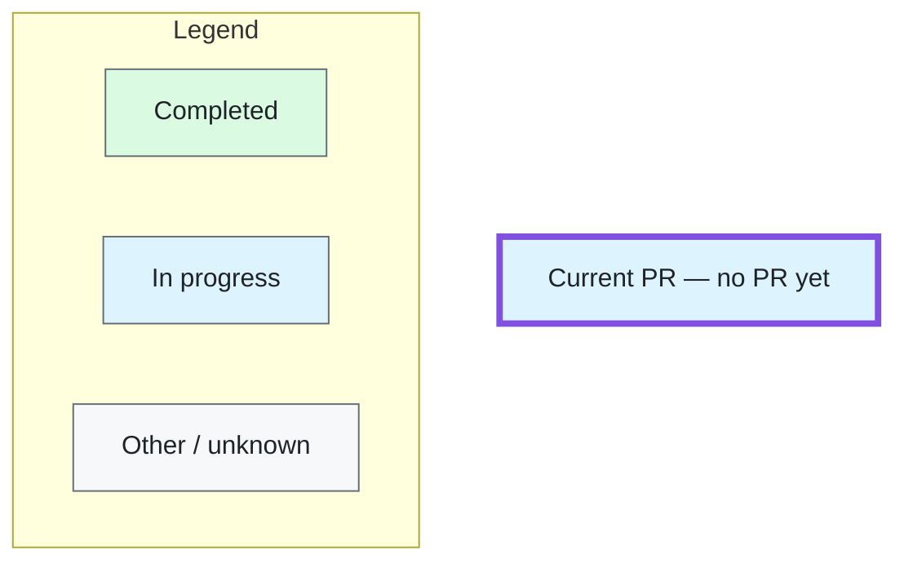

<!-- Fill this for UI, CLI and API PRs. See docs/engineering/symphony/pull-requests.md.
Remove instructions and unused optional sections before publishing. -->

## Context

<!-- In 2–3 short sentences: what changes, which specific linked project goal
it advances, and why that matters to users or the business. For standalone work,
link the commissioned issue goal. Assume no knowledge of the code. -->

## TL;DR

<!-- One short, plain-language sentence describing the result. -->

Base: <!-- selected base branch -->

## Progress

<!-- Link the current accepted plan and state when PR/issue statuses were checked.
For a project DAG, replace CURRENT with its actual nodes/edges and verified PR
links; preserve the styles and legend. For standalone work, keep one task node.
Label each node with its issue, short purpose, PR number or "no PR yet", and state.
After creation, add: click CURRENT href "ACTUAL_PR_URL" "Open current PR" _blank
Never guess a PR URL. Refresh this graph and the summary on replan/status changes. -->

Thick purple outline + “Current PR” identifies this PR independently of status.

## Summary

<!-- Start with the product/change outcome, then a few concise implementation bullets. -->

## Alternatives

<!-- Include only useful alternatives or tradeoffs; remove this section otherwise. -->

## Test plan

<!-- Report actual commands/results and tested SHA: local → Docker if needed → CI.
Use this repository's package.json and relevant targeted checks. Link current-head
CI and GitHub diagram-rendering evidence; distinguish pending work from passes.
Name material limitations and the next handoff. Never pre-check unrun tests. -->
