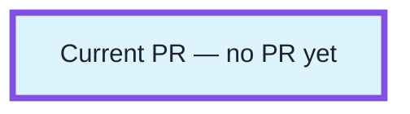

<!-- Fill this for UI, CLI and API PRs. See ../docs/engineering/symphony/pull-requests.md.
Remove instructions and unused optional sections before publishing. -->

## Context

<!-- In 2–3 short sentences: what changes, which specific linked project goal
it advances, and why that matters to users or the business. For standalone work,
link the commissioned issue goal. Assume no knowledge of the code. -->

## TL;DR

<!-- One short, plain-language sentence describing the result. -->

Base: <!-- selected base branch -->

## Progress

<!-- Include a progress diagram only when the accepted plan has at least three
meaningful nodes and two genuine edges. Otherwise remove the diagram scaffold
and its explanation; use a short progress sentence if useful, or remove this section.
Do not invent nodes or dependencies to meet the threshold.
For a qualifying diagram, link the current accepted plan and state when PR/issue
statuses were checked.
First remove the separate HTML-comment delimiter lines around the scaffold below.
Only then add nodes or edges: Mermaid arrows contain the closing-comment sequence.
Replace CURRENT with the plan's actual nodes/edges and verified PR links;
preserve the styles. The single node below is a style scaffold, not a publishable diagram.
Label each node with its issue, short purpose, PR number or "no PR yet", and state.
After creation, add: click CURRENT href "ACTUAL_PR_URL" "Open current PR" _blank
Never guess a PR URL. Refresh this graph and the summary on replan/status changes.
Remove these instructions and fill the scaffold before publishing;
leave no placeholders. -->

<!--

Thick purple outline + “Current PR” identifies this PR independently of status.
-->

## Summary

<!-- Start with the product/change outcome, then a few concise implementation bullets. -->

## Alternatives

<!-- Include only useful alternatives or tradeoffs; remove this section otherwise. -->

## Tested

<!-- Keep this short: summarize relevant results once, with the tested SHA and CI/artifact links.
Include only commands a reviewer needs to assess this change; link the workpad for full logs and repeated command lists.
Validate local → Docker if needed → CI, without copying that checklist into every PR.
Use the target repository's validation guidance and package/build configuration.
Link GitHub diagram-rendering evidence when relevant; distinguish pending work from passes.
Name material limitations and the next handoff. Never pre-check unrun tests. -->
