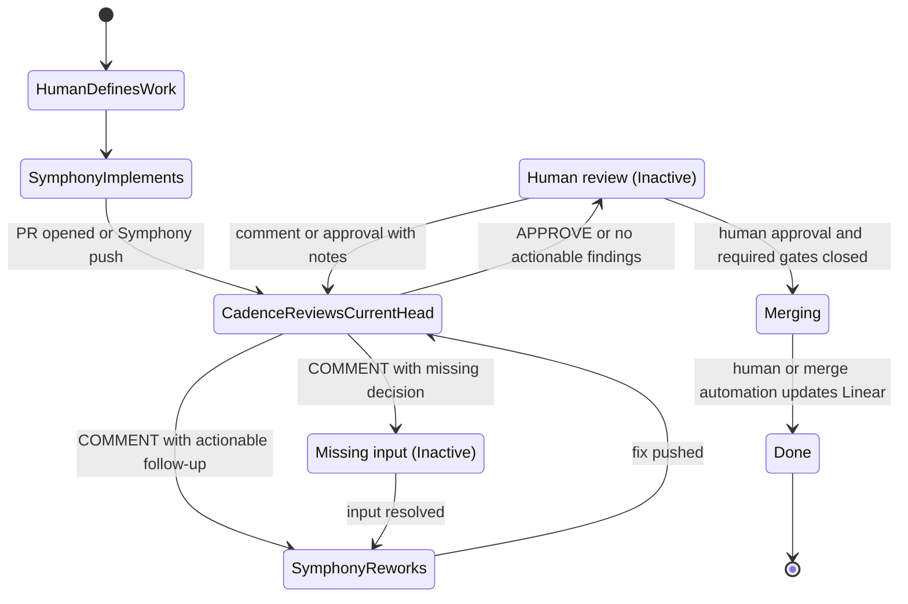
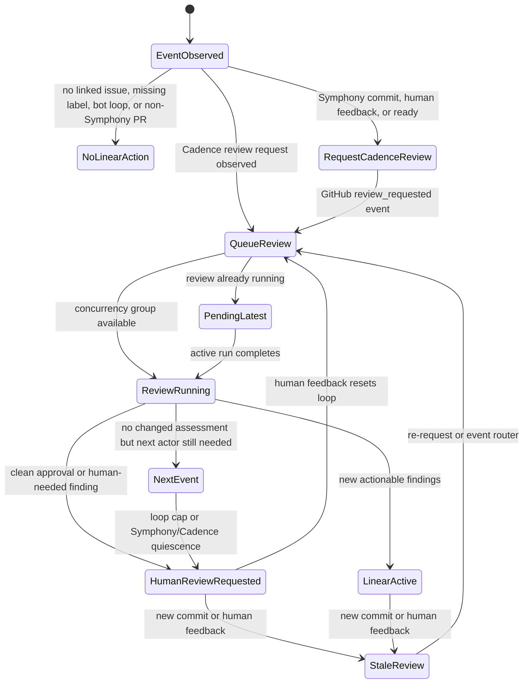

# Cadence AI Review Automation

Cadence AI Review is the mandatory automation lane for Symphony-managed PRs.
The normal gate is the shared `symphony` label; PR-open and synchronize events
from `example-symphony-bot` to its own open PR may run before that label is applied
so the open-then-label race does not drop the first bot-authored update. Cadence reviews
the PR against its Linear acceptance criteria and linked design docs before human
review. Its automated scope is Symphony-managed PRs. It is separate from
ordinary human PR review and from the general review-agent methodology.

The review logic lives in the `cadence-ai-review` skill
(`.claude/skills/cadence-ai-review/`). The GitHub workflows provision
credentials and run Claude Code against that skill. Cadence writes detailed
review state to one Linear comment headed `## Cadence Workpad`, then posts one
concise GitHub PR review per completed pass (`APPROVE` when clean, otherwise `COMMENT`;
never `REQUEST_CHANGES`).

## PR Actor Flow

Symphony implements and reworks issues in `Active`. CI, Cadence review, human
review, and missing input are external waits in `Inactive`. The diagram names
actor phases; those phases are not additional required Linear states.

The [project workflow](../symphony/project-workflow.md) defines current-team
fallbacks. The DEMO team has `Active` and `Inactive`; review bridges use legacy
`Rework` only on teams missing `Active`. Human or accepted merge automation owns
the terminal `Done` transition.

| Phase                       | Owner                     | Responsibility                                                                                                                                       |
| --------------------------- | ------------------------- | ---------------------------------------------------------------------------------------------------------------------------------------------------- |
| `HumanDefinesWork`          | Human                     | Defines the Linear issue, scope, acceptance criteria, and reviewer expectations.                                                                     |
| `SymphonyImplements`        | Symphony                  | Branches from the selected base, implements the issue, records evidence in `## Codex Workpad`, opens or updates the PR, and asks Cadence for review. |
| `CadenceReviewsCurrentHead` | Cadence                   | Reviews the current PR head, writes durable state to `## Cadence Workpad`, and posts a concise `APPROVE` or `COMMENT` PR review.                     |
| `SymphonyReworks`           | Symphony                  | Handles actionable Cadence or human feedback, pushes the smallest appropriate fix, and sends the updated head back through Cadence.                  |
| Missing input               | Human or agent            | Supplies a missing decision, credential, source, or environment detail before Symphony can continue.                                                 |
| Human review                | Human                     | Uses the PR, Cadence review, and workpads to decide merge readiness. A comment without approval is de facto a request for more work.                 |
| `Merging`                   | Human or merge automation | Merges the PR after human approval and required checks/review gates are closed.                                                                      |
| `Done`                      | Human or merge automation | Moves the linked Linear ticket to `Done` after accepted work is complete.                                                                            |

### GitHub Review Handoff Contract

The next actor should be visible through GitHub events wherever possible,
rather than through hidden Symphony or Cadence-only decisions:

- Symphony PR opens, Symphony commits, human PR comments, human PR reviews,
  inline review comments, and ready-for-review events request or re-request
  review from `example-cadence-bot`. That GitHub reviewer request is the visible
  queued state.
- A `pull_request_target.review_requested` event whose requested reviewer is
  `example-cadence-bot` invokes the single-PR Cadence review workflow. Review
  requests for other reviewers do not invoke Cadence.
- Cadence posts an `APPROVE` PR review when the current head has no blocker or
  human-needed findings. The Cadence review-submitted workflow then requests
  human review from the PR assignee. If no eligible PR assignee exists, it
  records a visible routing gap instead of requesting a broad human team.
- Cadence posts a `COMMENT` PR review when the current head has actionable
  findings or needs human input. The `cadence-linear-rework.yml` workflow moves
  the linked Linear issue to `Active` for actionable findings and requests
  eligible human PR assignees for human-needed findings. A human-review request
  leaves Linear state unchanged; Symphony records missing decisions in its
  workpad and waits in `Inactive`.
- Human non-approved review summaries with content, `CHANGES_REQUESTED`
  reviews, and nonempty top-level PR comments also wake the linked issue
  directly. Human `APPROVED` reviews do not directly wake Linear, but still
  re-request Cadence so a human approval with notes receives a Cadence re-look.
- Human reviewers own final merge readiness. Cadence approval is advisory and
  does not satisfy branch-protection human approval requirements.

## Dispatch And PR Selection

There is one request router, one review-request runner, and one manual request
entry point.

The Cadence review event state machine is:

No Linear-linked ticket is silently ignored by the configured Cadence event
surfaces. Every linked-ticket event records or performs one explicit outcome:
request or re-request Cadence review, run the Cadence review from the resulting
review-request event, move the linked issue for Symphony rework, ask for human
input, or record the skip/escalation reason in the Cadence workpad. Events with
no linked Linear issue, closed PRs,
non-Symphony PRs, missing `symphony` labels outside the bot synchronize race,
and non-human bot actors are explicit no-review paths rather than review loops.

The single-PR workflow is
`.github/workflows/cadence-ai-review-trigger.yml`. Its normal entry is
`pull_request_target.review_requested` when the requested reviewer is
`example-cadence-bot`. Direct `workflow_dispatch` and `workflow_call` remain only as
break-glass fallbacks; the automated router and legacy group workflow do not
call them. The trigger normally requires the `symphony` PR label, with a narrow
exception for Cadence's synthetic review-request event while labels are
settling. It runs with a deterministic concurrency group keyed by repository and
PR number. GitHub keeps the active review running and collapses pending
duplicate triggers to the latest pending run. Project color labels such as
`cyan` still identify Symphony project lanes for humans, but Cadence's review
gate is the shared `symphony` label.

The event router's concurrency key includes repository, PR, available head SHA,
and review/comment context. Submitted review comments share their review id;
standalone comments and edits retain their own context. The review runner uses
a separate repository/PR concurrency group. Each group keeps one active and one
latest pending run; this coalesces bursts but does not promise exactly one run
per head. The workpad records context keys and skipped-event reasons.

The [review-request helper](../../../.github/workflows/scripts/request-pr-reviewer.mjs)
clears an existing request, verifies its removal, and requests review again.
If the request remains present or GitHub only reports an already-requested
review, the helper fails visibly: an idempotent POST is not evidence of a fresh
`review_requested` event.

Before a stale approval re-review, the single-PR workflow tries to dismiss stale
approvals authored by `example-cadence-bot`. GitHub can reject self-dismissal for
the triage-scoped Cadence token; when that happens, the workflow uses the
Cadence review request UI as the supported visible stale-state marker. A
Cadence `review_requested` trigger is already visible pending re-review, and
other stale paths try to re-request `example-cadence-bot`. The check fails only when
GitHub allows neither dismissal nor visible review re-request.

The event router is `.github/workflows/cadence-ai-review-events.yml`. It listens
for PR opens, ready-for-review transitions, PR comments, submitted or edited PR
reviews, and created or edited inline review comments. Submitted inline review
comments also arrive with the submitted PR review event; the inline-comment
event covers standalone inline comments and post-submission edits. Every
configured event reaches the lightweight router job; the router classifies the
triggering actor with the
[GitHub Actor Classification](./github-actor-classification.md) helper and
requests or re-requests Cadence review when the PR has the required `symphony`
label and the event is human-facing, or when the event is a Symphony PR open or
synchronize push to Symphony's own PR before labels are applied. Closed PRs,
missing labels, non-Symphony PRs, and bot-loop events are recorded as explicit
skips when the linked Linear issue can be identified. The router never starts
Claude directly.

| Event surface                         | Listening workflow              | Runner / action                                                                                              |
| ------------------------------------- | ------------------------------- | ------------------------------------------------------------------------------------------------------------ |
| Symphony opens a PR                   | `cadence-ai-review-events.yml`  | Requests `example-cadence-bot` review; the label gate is waived for the bot-authored open-then-label race.       |
| Symphony commit to an open PR         | `cadence-ai-review-events.yml`  | Re-requests `example-cadence-bot` review so stale approvals stop looking current.                                |
| Human PR comment                      | `cadence-ai-review-events.yml`  | Re-requests `example-cadence-bot` review; human feedback resets the Cadence loop count in the review run.        |
| Human PR review summary               | `cadence-ai-review-events.yml`  | Re-requests `example-cadence-bot` review; submitted review summaries cover submitted inline comments.            |
| Inline review comment                 | `cadence-ai-review-events.yml`  | Re-requests `example-cadence-bot` review for standalone created comments and post-submission edits.              |
| Ready-for-review event                | `cadence-ai-review-events.yml`  | Requests `example-cadence-bot` review.                                                                           |
| Cadence review request or re-request  | `cadence-ai-review-trigger.yml` | Runs the single-PR Cadence review; explicit re-requests force a current-head review.                         |
| Manual PR list or label sweep         | `cadence-ai-review.yml`         | Resolves PRs and requests or re-requests `example-cadence-bot`; the review request starts the trigger workflow.  |
| Cadence review with actionable output | `cadence-linear-rework.yml`     | Wakes the linked Linear issue to `Active`, which is the machine-readable wakeup for Symphony.                |
| Cadence review needing human input    | `cadence-linear-rework.yml`     | Requests human review from the PR assignee, or records a visible no-assignee routing gap.                    |
| Clean Cadence approval                | `cadence-linear-rework.yml`     | Requests human review from the PR assignee, or records a visible no-assignee routing gap.                    |
| Human review with actionable summary  | `cadence-linear-rework.yml`     | Wakes the linked Linear issue to `Active`; direct human review feedback does not need Cadence to restate it. |
| Human PR conversation comment         | `cadence-linear-rework.yml`     | Wakes `Active` for nonempty human comments on eligible PRs; Cadence re-review is requested separately.       |

Manual group review remains available through
`.github/workflows/cadence-ai-review.yml`. It runs through `workflow_dispatch`,
with two optional inputs (at least one is required):

- `pr_numbers`: a comma- or space-separated list of PRs to review as a group.
- `review_label`: review every open PR carrying this label as a group.

A single PR is a group of one. The manual workflow is orchestration only: it
resolves the requested PRs, fans out with a matrix, and requests or re-requests
Cadence review once per PR. Use manual group review when a human wants an
explicit PR list or label sweep. Direct single-PR dispatch of the trigger
workflow is reserved for break-glass retries when review-request events cannot
be used.

## Automated Triggers And Manual Fallbacks

For this project, automated Cadence review is label-gated and actor-gated:

- A human-facing PR comment, PR review, inline review comment, or
  ready-for-review event can request or re-request Cadence when the PR has the
  `symphony` label.
- A review request targeting `example-cadence-bot` invokes the single-PR trigger
  workflow. Non-Cadence reviewer requests do not invoke Cadence.
- A `pull_request_target.opened` or `pull_request_target.synchronize` event from
  `example-symphony-bot` to its own open PR can request Cadence review so Cadence
  reviews new Symphony PRs and commits; the label gate is waived only for this
  bot-authored open/update request path.
- Cadence, Claude, dependency bots, generic `[bot]` actors, closed PRs,
  non-Symphony PRs, and PRs without the `symphony` label outside the bot
  open/update race do not queue review. The router records those skips in the
  Cadence workpad when the linked issue can be identified.
- Human feedback enters the same Cadence/Symphony review loop regardless of
  GitHub review state. Humans do not need to use GitHub's formal
  `CHANGES_REQUESTED` review state; a human comment without approval is de
  facto a request for more work until Cadence re-looks and the next actor is
  explicit.
- Cadence review loop labels (`cadence-loop-N`) are advanced by the single-PR
  workflow. Human-grounded activity resets the next run to `cadence-loop-1`;
  agent-only continuation stops at the configured cap and requests review from
  the PR assignee with the concrete reason in the Cadence workpad. When
  Symphony and Cadence are quiescent with no review-relevant changes, the
  workflow requests the assigned human next actor instead of asking Symphony to
  retry without an action. If there is no eligible PR assignee, the workflow
  records a visible routing gap rather than falling back to a broad human team.

Manual fallbacks remain part of the contract. A human can dispatch the manual
group workflow to re-request Cadence, use the single-PR trigger's direct
dispatch as a break-glass retry, or route Linear state manually when a
credential, team-lookup, or issue-linking problem prevents the automation from
making an authoritative decision.

## Required Configuration

Set these values in Settings → Secrets and variables → Actions → Secrets.
Required when using the workflow that consumes them; there are no credential
defaults. All values come from adopter-owned accounts. Never commit them.

Repository secrets:

- `CADENCE_AI_REVIEW_ANTHROPIC_API_KEY`: Claude API key for the review.
- `CADENCE_BOT_GITHUB_TOKEN`: the reviewer bot's GitHub token (classic, `repo`
  scope). Used both for the action's `github_token` and as `GH_TOKEN` for the
  bot's `gh` calls and actor/team lookups. The bot account has **Triage**
  repository access, so its approvals do not count toward required reviews.
- `CADENCE_LINEAR_API_TOKEN`: Linear API token used by
  `scripts/fetch-linear-issue.mjs` to read issue context, by
  `scripts/cadence-linear-workpad.mjs` to write the Cadence workpad, and by the
  review workflow when optional Linear-side Cadence state can be written.
- `GOOGLE_SA_KEY`: a Google service-account JSON key. Staged to a file and read
  by `scripts/fetch-google-doc.mjs` to export linked design docs.

- `AWS_ACCESS_KEY_ID` and `AWS_SECRET_ACCESS_KEY`: the AWS access-key ID and
  paired secret used only by the host AMI workflow. Supply a principal authorized
  to inspect images in the configured account. These are separate from Cadence's
  review credentials and from the host's AWS Secrets Manager JSON bundles.

Set repository variables in Settings → Secrets and variables → Actions →
Variables. Identity values must name the accounts behind the supplied tokens:

- `SYMPHONY_BOT_USER`: coding bot GitHub login. Required for live attribution;
  synthetic fallback `example-symphony-bot`.
- `CADENCE_REVIEWER`: review bot GitHub login. Required for live review;
  synthetic fallback `example-cadence-bot`.
- `SYMPHONY_REPOSITORY_OWNER`: GitHub organization slug used for team lookup.
  Optional in workflows (default: `github.repository_owner`); export it for
  standalone helpers, whose fallback `example-org` is synthetic.
- `CADENCE_GIT_EMAIL`: review bot commit email for the AMI workflow. Required
  for real attribution; synthetic fallback `example-cadence-bot@users.noreply.github.com`.
- `AWS_ACCOUNT_ID`: 12 decimal digits identifying the host account. Required
  for the AMI workflow; no default.
- `SYMPHONY_HUMAN_LEAD`: GitHub login to assign AMI update PRs. Optional; default:
  unset (no assignee).

Review model variable:

- `CADENCE_CLAUDE_MODEL`: required Claude model for the review. The trigger
  preflight approves `claude-opus-5` for the Opus 5 review requirement and fails
  before Claude runs when the variable is unset or points to an unapproved
  model.

## Identities

- **Review bot**: the account named by `CADENCE_REVIEWER` authors reviews via
  `CADENCE_BOT_GITHUB_TOKEN`. `example-cadence-bot` and `cadence@example.invalid`
  are synthetic login/contact examples.
- **Google service account**: its own `<service-account>@<project>.iam.gserviceaccount.com` email reads
  design docs. Share each doc, folder, or shared drive with that email as
  Viewer. This is a distinct identity from the GitHub bot.
- **Linear API token**: reads ticket context and writes the Cadence workpad.

## Actor Authority

For design decisions, a human with verified repository write access is
authorized to amend accepted designs and execution contracts. No separate
design-owner, project-lead, or team ratification is required. Record the decision
and superseded criteria in the workpad; Symphony updates the affected artifacts
and implements and commits. A stale design document or contrary AI preference
is not a missing human decision. See the
[replanning guide](../symphony/replanning.md#human-design-authority).

Actor classification below identifies humans and bots for event routing; it
does not reserve design authority to a named human or team. If event delivery
excludes a verified human writer, report that as a routing configuration gap,
not a requirement for a design owner to decide again.

Cadence and Symphony use the
[GitHub Actor Classification](./github-actor-classification.md) contract to
decide whether GitHub activity is authoritative human review input, AI
coordination, dependency-bot activity, or unknown activity.

The classifier categories are `human`, `ai_actor`, `dependency_bot`,
`non_human_bot`, and `unknown`. The GitHub `humans` team is authoritative for
human review and learning behavior. The GitHub `ai` team and known AI actor
allowlists identify actors such as `example-symphony-bot`, `example-cadence-bot`, and
`claude[bot]`. Known dependency bots include `dependabot[bot]`.

Unknown actors are not team-authoritative until the `humans` team, the `ai`
team, or an explicit allowlist classifies them. Unknown actors ending in
`[bot]` are not treated as humans. Unknown non-bot actors remain human-facing
for conservative review routing, but their classification stays `unknown` so
workflows and workpads can surface the identity gap instead of silently
promoting them to known humans. If team membership cannot be read when a
workflow needs authoritative classification, record the credential blocker
rather than guessing.

## What It Reads

For each PR: title, body, base, head SHA, changed files, diff, labels, CI status
(via `gh`). The associated Linear issue's description, acceptance criteria, and
comments (via `scripts/fetch-linear-issue.mjs`, read-only). Design and
requirement docs linked from the Linear issue or PR body, including Google Docs
(via `scripts/fetch-google-doc.mjs`).

Cadence reads the `## Codex Workpad` when a re-review needs Symphony execution
context, such as claimed fixes, validation evidence, deferred decisions, or
human feedback already handled by the coding agent. It reads that workpad as
input only; Cadence does not edit Symphony's workpad.

Both acquisition helpers are dependency-free and run with bare `node` locally
and on the runner, so the review reads the same way in both environments.
For docs/process PRs that touch workflow docs, agent instructions, checked-in
skills, runtime-bundle docs, or standing operational docs, Cadence also loads
`scripts/symphony/runtime-bundle/review-axes/standing-docs-current-state.md`.
Process requirements and design PRs use `cadence-ai-review`; the UI-focused
`.claude/skills/design-review/SKILL.md` skill is not the process reviewer.

## Output

Cadence has two output surfaces with different audiences:

- **Linear `## Cadence Workpad`**: detailed review state for Symphony and future
  Cadence runs, written through the
  [Cadence Linear Workpad](./cadence-linear-workpad.md) helper.
- **GitHub PR review**: concise human-readable assessment for PR reviewers.

The Linear workpad owns run status, trigger source, review decision, head SHA,
last-reviewed SHA and timestamp, prior or pending rerun state, skipped or
ignored events, requirement coverage, detailed findings, human-feedback learning
notes, and AI-to-AI coordination.

Symphony treats the Linear workpad as Cadence's durable handoff. Before
performing Cadence-driven rework, deciding that no Cadence action remains, or
summarizing review state for a human, Symphony should read the current
`## Cadence Workpad` instead of reconstructing Cadence state from GitHub review
text alone.

The GitHub review owns the concise assessment for the reviewed head, with the
reviewed SHA and workpad link. Each completed pass explains why the PR is
acceptable, blocked, or needs human input. Earlier reviews remain in GitHub
history; the single Linear workpad is updated in place.
Line-specific findings may use inline review comments when the exact location
helps a human reviewer act. Raw coverage tables, skipped-event detail, and
scratchpad reasoning stay on Linear.

The review event is chosen by findings: `APPROVE` when the PR has no `blocker`
and no `human-needed` findings, otherwise `COMMENT`. `REQUEST_CHANGES` is never
used. Posting output as PR reviews (not plain conversation comments) keeps the
event surface `pull_request_review`.

The reviewer bot has **Triage** (not Write) repository access, so its `APPROVE`
shows as an approval signal but does **not** count toward branch-protection
required reviews; a human approval is still required to merge. (Confirmed: a
Triage-role classic token can post reviews via the API.)

Reviews are submitted from one verified context. In a fan-out, workers return
review bodies and the orchestrator posts after confirming `gh api user` matches
the reviewer identity. A mismatch, such as a token falling back to another
login, aborts the review submission.

## Human Review And Follow-Up Routing

Cadence is advisory. Human reviewers and the project human lead own final review
judgment, priority, and merge readiness. The automated human handoff requests
eligible PR assignees only. It does not
fall back to the Linear issue assignee, project lead, or a broad human team.
If none is eligible, it records a routing gap in Linear for manual handling.

Human feedback is authoritative Symphony input. Symphony can act on direct human
GitHub review feedback without waiting for Cadence to restate it. Cadence should
still receive post-human-review events and re-look unless the state fetch shows
the current Cadence review is still fresh. Cadence adding no findings is
expressed as an `APPROVE` review and `## Cadence Workpad` handoff, not as silent
retry pressure on Symphony.

`pull_request_target` workflow definitions are evaluated from the repository's
default branch. A PR that changes the Cadence review-request trigger cannot
fully dogfood that new trigger until the workflow lands on `main`; use the
workflow's static tests and, if needed, a break-glass manual dispatch to validate
the new trigger before merge.

When human feedback reveals the same class of issue elsewhere in the PR, a
reviewer-facing documentation gap, or an in-scope requirement gap, Cadence may
record human-grounded follow-up:

- **Mandatory follow-up** is directly grounded in human feedback and needed to
  resolve the same issue class, reviewer clarity gap, or in-scope requirement
  gap. Route it as `blocker` or `human-needed`, and put enough evidence in the
  Linear workpad for Symphony to perform Linear-driven rework.
- **Optional follow-up** is nice-to-have, speculative, or beyond the current
  issue's required outcome. Route it as `should-fix` or `suggestion`, label it
  non-blocking if mentioned on GitHub, and keep the detailed rationale in the
  workpad.

The single-PR workflow tracks Cadence review loops with `cadence-loop-N` labels
and a current cap of 3. Agent-to-agent continuation stops before runner
allocation when a Symphony push arrives on a PR already carrying
`cadence-loop-3`; the trigger workflow keeps the same cap as defense in depth
for direct and matrix invocations. Human comments and reviews always route
through and reset the loop back to `cadence-loop-1`.

## Request-Changes Enforcement

Three layers keep `REQUEST_CHANGES` off:

1. The skill restricts the event to `APPROVE` or `COMMENT`.
2. The workflow appends a system prompt repeating that constraint.
3. A post-run audit step (`Block request-changes reviews`) dismisses any
   `CHANGES_REQUESTED` review authored by the bot on a target PR and fails the
   job.

## Linear Write-Back

Cadence writes detailed review state only to the single Linear issue comment
headed `## Cadence Workpad`. It does not create ad hoc Linear comments and does
not edit `## Codex Workpad`.

The `## Codex Workpad` remains Symphony-owned execution state. Cadence may read
it during re-review to understand Symphony's latest reasoning and evidence, but
any Cadence assessment, skipped-event detail, rerun state, or AI coordination
must be written back to `## Cadence Workpad` or the concise GitHub PR review as
described above.

The Cadence review skill and event/trigger workflows do not change Linear issue
labels, assignees, relations, or project metadata. `cadence-linear-rework.yml`
is the narrow review state-transition companion. It wakes `Active` for
actionable Cadence output, nonempty human PR conversation comments, non-approved
human review bodies, and human changes-requested reviews. It requires an open,
Symphony-authored PR with the `symphony` label. Human approvals do not directly
wake Linear. Clean Cadence approval and human-needed findings request eligible
PR assignees without changing Linear state. Symphony owns the `Inactive` wait
and records the current checks and next actor.

The shared wakeup helper prefers `Active`, uses only `Rework` as a legacy
fallback, and fails when neither exists. It preserves `Done`, `Canceled`,
`Cancelled`, `Duplicate`, and terminal Linear categories. The review bridge
pins a writable Cadence workpad and re-reads issue state before waking. It
records actual state/mutation results, actor, reason, PR/head, event id, and run
URL in `coordination.reviewHandoff` and the workflow summary. Independent writers
are not atomic; skipped or failed writes are reported rather than treated as
confirmed transitions.

The [non-review bridge](../symphony/project-workflow.md#github-event-bridges)
shares those wakeup semantics for required-check failures, merge conflicts, and
issue-scoped workflow completions. If Cadence cannot identify the linked Linear
issue or lacks the required Linear token for an optional workpad write, it
reports that visibly instead of guessing.

For a dispatched workflow on a `symphony/` branch, adopters may set their
workflow's top-level `run-name` to begin with `[linear:<issue>] `, followed by a
description. The marker must contain one valid issue identifier and a trailing
space after the closing bracket. This optional marker identifies the issue when
the completion payload has no dispatch inputs or linked PR; it takes precedence
over the PR title and branch. Without it, the bridge resolves the PR title, then
the branch, and rejects missing or ambiguous identity. The extraction supplies
the consumer only; adopters choose whether their own workflows produce this
marker. A marker does not enable completion routing from a non-Symphony branch.

## Slack

Slack notifications are deferred. This workflow does not reference Slack secrets
and does not send Slack messages.
