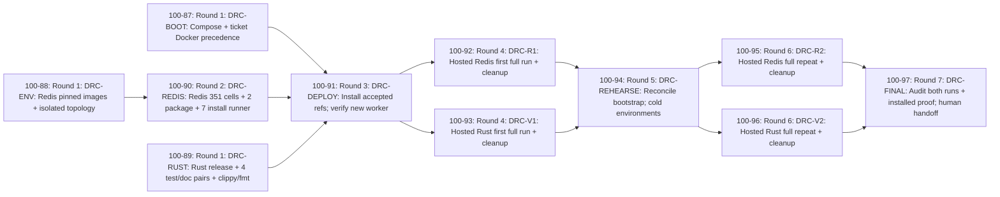

# Hosted Docker and Rust CI fan-out plan

Proposed under [100-71](https://linear.app/1000lines/issue/100-71).
Human review and merge precede [100-72 fan-out](https://linear.app/1000lines/issue/100-72).
This ticket creates no downstream issues and performs no project implementation,
shared-host installation or workload acceptance.

```yaml
project_code: docker-rust-ci
project_color: green
repository: 1000lines/symphony-example
base_branch: main
seed_issue: 100-71
target_project: Symphony Docker and Rust CI
human_lead: Jeremy Carroll
human_lead_github: jeremycarroll
human_lead_linear: c65b9fbe-e740-47e9-b444-3172d3526ff2
linear_issue_labels: [green]
github_pr_labels: [green, symphony]
```

The plan has **11 new tasks, 12 direct hard edges and 7 dependency rounds**.
Four source changes deliver Compose/mode support and the two workload recipes;
seven delivery tasks prove installation, complete first runs, bootstrap rehearsal,
complete cold repeats and final cleanup. No existing implementation/finalize
ticket was found. Reuse the three seeds: 100-70 Done (design PR #52 merged),
100-71 planning, 100-72 fan-out. Keep existing 100-70 → 100-71 → 100-72 relations;
these seed relations are outside the implementation graph and are not recreated.

| Task     | Estimated added / deleted lines | Files and principal uncertainty                              |
| -------- | ------------------------------- | ------------------------------------------------------------ |
| BOOT     | 180–320 / 10–40                 | 9; plugin discovery, installer rerun and mode guidance       |
| ENV      | 550–850 / 0                     | 6–10 new; UID, image/constraint and network compatibility    |
| REDIS    | 450–750 / 0                     | 4–7 new; exact matrix/package translation and failure ledger |
| RUST     | 180–350 / 0                     | 4–6 new; lock/components and upstream lint compatibility     |
| DEPLOY   | 140–240 / 0                     | 2 evidence/runbook; operator window and installed provenance |
| R1       | 120–220 / 0                     | 1 index; 360 cells plus MultiDB, lint/audit; logs attached   |
| V1       | 90–160 / 0                      | 1 index; 12 actual Rust commands; logs attached              |
| REHEARSE | 90–180 / 0–20                   | 2; replacement host or disclosed reconciliation fallback     |
| R2       | 120–220 / 0                     | 1 index; full cold Redis repeat, same immutable inputs       |
| V2       | 90–160 / 0                      | 1 index; full cold Rust repeat, same lock/image              |
| FINAL    | 120–220 / 0–100                 | 1 index plus only justified sequential cleanup               |

Estimates are review heuristics, not quotas. ENV and REDIS have the largest
uncertainty: retain upstream scripts/Compose and use existing libraries, without
a generic runner, new scheduler or parallel infrastructure. If coherent work
exceeds these estimates, explain the diff or use the existing replan rules.
Long acceptance runtime is not a large source PR; bounded resume retains a
complete ledger without reducing the agreed workload.

## Fan-out record

[100-72](https://linear.app/1000lines/issue/100-72/trigger-fan-out) executed the
human-reviewed plan merged in [PR #54](https://github.com/1000lines/symphony-example/pull/54)
at `dcafa8d17959762945e760bb5ddf2c38c8b6a0cb`. All eleven tickets were staged in
Backlog, their twelve direct blocker relations read back in both directions,
then activated. They are assigned to Jeremy Carroll with the green label.
The graph labels below contain the resulting identifiers; node IDs, payload
keys, branch templates and direct-edge declarations are unchanged.

Mermaid click directives are omitted because the installed shared DAG parser
rejects them. The mapping provides clickable issue links and concrete task
branches; both committed graph copies remain synchronized. Every task branch
and PR uses main, with branch birth on dispatch and draft PR creation.

| Payload key  | Linear issue                                                                                               | Task branch                                         |
| ------------ | ---------------------------------------------------------------------------------------------------------- | --------------------------------------------------- |
| DRC-BOOT     | [100-87](https://linear.app/1000lines/issue/100-87/install-compose-and-preserve-explicit-docker-execution) | `symphony/docker-rust-ci/100-87/compose-and-mode`   |
| DRC-ENV      | [100-88](https://linear.app/1000lines/issue/100-88/prepare-reproducible-isolated-redis-environments)       | `symphony/docker-rust-ci/100-88/redis-environments` |
| DRC-RUST     | [100-89](https://linear.app/1000lines/issue/100-89/package-the-complete-pinned-rust-workload)              | `symphony/docker-rust-ci/100-89/rust-workload`      |
| DRC-REDIS    | [100-90](https://linear.app/1000lines/issue/100-90/run-and-account-for-the-full-redis-ci-workload)         | `symphony/docker-rust-ci/100-90/redis-workload`     |
| DRC-DEPLOY   | [100-91](https://linear.app/1000lines/issue/100-91/install-accepted-tooling-and-verify-a-new-worker)       | `symphony/docker-rust-ci/100-91/rollout`            |
| DRC-R1       | [100-92](https://linear.app/1000lines/issue/100-92/execute-the-complete-first-hosted-redis-run)            | `symphony/docker-rust-ci/100-92/redis-first`        |
| DRC-V1       | [100-93](https://linear.app/1000lines/issue/100-93/execute-the-complete-first-hosted-rust-run)             | `symphony/docker-rust-ci/100-93/rust-first`         |
| DRC-REHEARSE | [100-94](https://linear.app/1000lines/issue/100-94/reconcile-bootstrap-and-recreate-cold-environments)     | `symphony/docker-rust-ci/100-94/rehearsal`          |
| DRC-R2       | [100-95](https://linear.app/1000lines/issue/100-95/repeat-every-redis-cell-after-rehearsal)                | `symphony/docker-rust-ci/100-95/redis-repeat`       |
| DRC-V2       | [100-96](https://linear.app/1000lines/issue/100-96/repeat-the-full-rust-workload-after-rehearsal)          | `symphony/docker-rust-ci/100-96/rust-repeat`        |
| DRC-FINAL    | [100-97](https://linear.app/1000lines/issue/100-97/audit-acceptance-cleanup-and-human-handoff)             | `symphony/docker-rust-ci/100-97/finalize`           |

Creation and activation do not establish implementation, deployment or hosted
workload acceptance. Those obligations remain with the generated tickets.

## Sources and baseline

- Read the live [project brief](https://linear.app/1000lines/project/symphony-docker-and-rust-ci-aa1fa72bda08),
  this issue, all comments, seed inventory and relations on September 12, 2026.
  Metadata above is confirmed; no new product decision or hold was found.
- Read [requirements/design](requirements-and-design.md) on selected
  main `70a8a2415085598ea86e63a71f11faff85cb54c1`, including all R01–R08/D01–D07.
  [PR #52](https://github.com/1000lines/symphony-example/pull/52) merged at that
  SHA; 100-70 is Done. Its introductory proposed-status text is historical;
  GitHub merge/Linear acceptance establish the planning baseline.
- Read the brief's pinned implementation inputs at
  `e362e5ad76fa8070ef27bf54fec9d6750195466c`: hosted WORKFLOW.md,
  host install steps 10/35/60, and prior 100-7 fan-out example. Read current
  README, SYMPHONY, configuration, package/toolchain, workflow/PR guidance,
  generic planning README/schema/criteria and proof/Cadence contracts.
  These are source observations, not current installed-run evidence.
- Read all pinned upstream sources from primary raw GitHub URLs (HTTP 200):
  Redis integration workflow, package script and Compose at
  `41585545ee8284d3a51797fdfa1ff995866ab558`, plus run-tests composite action;
  Rust CI, Cargo.toml and README at
  `99528c2e4da241ec2c9961d0a155357611f16a76`.
  Exact URLs and image inventories are preserved in the design's source table.
  Redis master and Rust main are source selectors, never implementation PR bases.
- Read shared DAG tooling at `$SYMPHONY_TOOLING_ROOT/tools/symphony-dag/`,
  tooling checkout `a3b7428a9e0298592e119a57923854b75a9b61a0`.
  Use its parser and renderer; no shared schema or criteria changes are made.
- No required primary source is unavailable. Web-reader cache misses recovered
  through HTTP 200 raw source reads. As disclosed in the accepted design, the
  brief's historical Copier revision `e7a9be3` has no repository locator and
  its template contents remain unverified; the complete live seed/brief are the
  contract, and no acceptance conclusion depends on that provenance.
- Design discovery found no Compose, no native cargo/rustc, Python below Redis's
  minimum and a host port-4000 conflict. Installed reader lag and EACCES on
  bootstrap provenance belong to DEPLOY's new-worker/operator readback. They
  are not silently converted into completed work or global prerequisite tickets.

The [implementation items](implementation-items.md),
[delivery items](delivery-items.md) and
[execution contract](execution-contract.md) are normative parts of this plan.
Each generated description includes the complete owning section and contract.
Only these project documents and matching Mermaid are changed by this seed.

## Decomposition and resource ownership

A three-task split (bootstrap, Redis, Rust with operations folded in) would mix
shared-host changes with independent code review, leave replay ordering inside
large tickets and repeatedly transfer operational control. A strictly serial
eleven-task plan would lose useful environment/toolchain and execution
independence without resolving an actual conflict. The chosen eleven-node DAG
keeps disjoint preparation in round 1, separates Redis environment and runner
review, and makes first-run/rehearsal/repeat/final evidence explicit.

Seven rounds count nodes on ENV → REDIS → DEPLOY → R1 → REHEARSE → R2 → FINAL.
They are minimum dependency rounds, not duration or promised worker capacity.
All edges are hard, with precise requirements in item descriptions. Each source
prerequisite must land on main before dependent code imports it; operational
edges order actual installed-state evidence and mutation windows. No transitive
edge adds an independent requirement, so all representations use the same
reduced twelve edges. Fan-in is multiple direct blockers, never a join.

BOOT, ENV and RUST have disjoint files and no shared mutable installation:
BOOT uses installer fixtures only; ENV/RUST use their own issue-namespaced
containers/caches and immutable registry inputs. REDIS consumes ENV's merged
interface and owns a different directory. DEPLOY then takes the only host
mutation window. R1/V1 share read-only installation and use distinct resources;
REHEARSE waits for both to clean up before taking the same host window.
R2/V2 run after that window closes. Aggregate CPU/memory/disk availability
can serialize runs operationally without creating an unrequested hard edge.
REHEARSE inherits the runbook only after DEPLOY; FINAL inherits the explicitly
listed implementation cleanup paths after both replays. No parallel file or
resource writer overlaps. All code/evidence publication remains in symphony-example.

## DAG



## Decisions

| Decision                                            | Rationale and enforcing ticket/artifact                                                                                                                                                          |
| --------------------------------------------------- | ------------------------------------------------------------------------------------------------------------------------------------------------------------------------------------------------ |
| D01: existing mode and arrays                       | BOOT preserves native/docker/remote and explicit ticket Docker precedence; DEPLOY proves installed behavior. No automatic wrapper/new dispatcher.                                                |
| D02: Docker for both workloads                      | ENV/REDIS/RUST and R1/V1/R2/V2 use the design's immutable images; native success cannot skip acceptance.                                                                                         |
| D03: full Redis coverage                            | REDIS maps 351 integration + 2 package + 7 install cells and 2 MultiDB substeps, separate lint/audit; R1/R2 execute all. Bound concurrency, retain failures, never shrink axes.                  |
| D04: isolated Redis namespace                       | ENV adapts Compose addresses and Stack port 6479, preserves real services/TLS/health; no public port or test assertion changes.                                                                  |
| D05: host orchestration and scoped ownership        | ENV/REDIS/RUST keep checkout/Docker calls on host; containers receive workspace files/UID and nonsecret variables only. All delivery owners verify cleanup.                                      |
| D06: minimal bootstrap support                      | BOOT adds missing Compose and guidance within existing paths. DEPLOY refreshes source/bundle/reader and explicitly reloads; no host Rust/Python fleet or engine change.                          |
| D07: source/install/first/repeat evidence separated | DEPLOY, R1/V1, REHEARSE, R2/V2 and FINAL enforce actual installed refs and full cold replays. Reconciliation fallback discloses untested host replacement.                                       |
| P01: clean main branches and direct blockers        | Manifest and relation table enforce main/main, draft PRs, no predecessor commits or join branches. Fan-out stages Backlog, verifies relations, then Active.                                      |
| P02: durable bounded adapters                       | ENV owns lifecycle/pins; REDIS owns coverage/results; RUST owns its small recipe. No temporary seams; FINAL audits approved later markers and explicitly retains justified durable translations. |
| P03: CI and fresh review before readiness           | Every item's execution contract requires exact-head implementation CI, configured Cadence closure, human-feedback check, clean branch and ready PR before mature. Human owns Done.               |
| P04: reusable planning tools                        | 100-71 uses shared parser/renderer; 100-72 copies complete reviewed bodies as documented below. No project-local planning infrastructure or schema changes.                                      |

## Manifest

This block is the branch manifest's machine-readable authority.
Payload keys are stable planning identifiers, not live Linear issue IDs.

```yaml
schema: symphony-dag-manifest/v1
project:
  code: docker-rust-ci
  color: green
  base_branch: main
  human_lead: Jeremy Carroll
  human_lead_github: jeremycarroll
  linear_issue_labels: [green]
  github_pr_labels: [green, symphony]
defaults:
  initial_state: Active
  maturity_label: mature
  task_branch_base: main
  task_pr_base: main
  task_pr_draft: true
  issue_assignee: Jeremy Carroll
  pr_assignee: jeremycarroll
  edge_semantics: hard prerequisites; source merged to main and operational evidence as specified per item
  relation_type: blocks
  mutation_policy: stage Backlog; verify identities and all direct relations; activate complete set
decisions: [D01, D02, D03, D04, D05, D06, D07, P01, P02, P03, P04]
nodes:
  - id: BOOT
    payload_key: DRC-BOOT
    title: Install Compose and preserve explicit Docker execution
    type: task
    difficulty: hard
    labels: [green]
    branch:
      template: symphony/docker-rust-ci/${issue}/compose-and-mode
      base: main
      birth: on_dispatch
    pr:
      create: on_branch_birth
      base: main
      draft: true
      labels: [green, symphony]
  - id: ENV
    payload_key: DRC-ENV
    title: Prepare reproducible isolated Redis environments
    type: task
    difficulty: hard
    labels: [green]
    branch:
      template: symphony/docker-rust-ci/${issue}/redis-environments
      base: main
      birth: on_dispatch
    pr:
      create: on_branch_birth
      base: main
      draft: true
      labels: [green, symphony]
  - id: RUST
    payload_key: DRC-RUST
    title: Package the complete pinned Rust workload
    type: task
    difficulty: hard
    labels: [green]
    branch:
      template: symphony/docker-rust-ci/${issue}/rust-workload
      base: main
      birth: on_dispatch
    pr:
      create: on_branch_birth
      base: main
      draft: true
      labels: [green, symphony]
  - id: REDIS
    payload_key: DRC-REDIS
    title: Run and account for the full Redis CI workload
    type: task
    difficulty: hard
    labels: [green]
    branch:
      template: symphony/docker-rust-ci/${issue}/redis-workload
      base: main
      birth: on_dispatch
    pr:
      create: on_branch_birth
      base: main
      draft: true
      labels: [green, symphony]
  - id: DEPLOY
    payload_key: DRC-DEPLOY
    title: Install accepted tooling and verify a new worker
    type: task
    difficulty: hard
    labels: [green]
    branch:
      template: symphony/docker-rust-ci/${issue}/rollout
      base: main
      birth: on_dispatch
    pr:
      create: on_branch_birth
      base: main
      draft: true
      labels: [green, symphony]
  - id: R1
    payload_key: DRC-R1
    title: Execute the complete first hosted Redis run
    type: task
    difficulty: hard
    labels: [green]
    branch:
      template: symphony/docker-rust-ci/${issue}/redis-first
      base: main
      birth: on_dispatch
    pr:
      create: on_branch_birth
      base: main
      draft: true
      labels: [green, symphony]
  - id: V1
    payload_key: DRC-V1
    title: Execute the complete first hosted Rust run
    type: task
    difficulty: hard
    labels: [green]
    branch:
      template: symphony/docker-rust-ci/${issue}/rust-first
      base: main
      birth: on_dispatch
    pr:
      create: on_branch_birth
      base: main
      draft: true
      labels: [green, symphony]
  - id: REHEARSE
    payload_key: DRC-REHEARSE
    title: Reconcile bootstrap and recreate cold environments
    type: task
    difficulty: hard
    labels: [green]
    branch:
      template: symphony/docker-rust-ci/${issue}/rehearsal
      base: main
      birth: on_dispatch
    pr:
      create: on_branch_birth
      base: main
      draft: true
      labels: [green, symphony]
  - id: R2
    payload_key: DRC-R2
    title: Repeat every Redis cell after rehearsal
    type: task
    difficulty: hard
    labels: [green]
    branch:
      template: symphony/docker-rust-ci/${issue}/redis-repeat
      base: main
      birth: on_dispatch
    pr:
      create: on_branch_birth
      base: main
      draft: true
      labels: [green, symphony]
  - id: V2
    payload_key: DRC-V2
    title: Repeat the full Rust workload after rehearsal
    type: task
    difficulty: hard
    labels: [green]
    branch:
      template: symphony/docker-rust-ci/${issue}/rust-repeat
      base: main
      birth: on_dispatch
    pr:
      create: on_branch_birth
      base: main
      draft: true
      labels: [green, symphony]
  - id: FINAL
    payload_key: DRC-FINAL
    title: Audit acceptance cleanup and human handoff
    type: task
    difficulty: hard
    labels: [green]
    branch:
      template: symphony/docker-rust-ci/${issue}/finalize
      base: main
      birth: on_dispatch
    pr:
      create: on_branch_birth
      base: main
      draft: true
      labels: [green, symphony]
edges:
  - from: ENV
    to: REDIS
  - from: BOOT
    to: DEPLOY
  - from: REDIS
    to: DEPLOY
  - from: RUST
    to: DEPLOY
  - from: DEPLOY
    to: R1
  - from: DEPLOY
    to: V1
  - from: R1
    to: REHEARSE
  - from: V1
    to: REHEARSE
  - from: REHEARSE
    to: R2
  - from: REHEARSE
    to: V2
  - from: R2
    to: FINAL
  - from: V2
    to: FINAL
```

## Branch manifest and task index

Every row declares branch base main, PR base main, birth on dispatch, draft PR
on branch birth, and ready transition only under the execution contract.
Replace ${issue} with the actual mapped Linear identifier after fan-out.
Complete owning item sections are keyed by DRC identifier in the linked file.

| Task / complete item                 | Branch template                                       | Branch base | PR base | PR policy                          |
| ------------------------------------ | ----------------------------------------------------- | ----------- | ------- | ---------------------------------- |
| [DRC-BOOT](implementation-items.md)  | `symphony/docker-rust-ci/${issue}/compose-and-mode`   | main        | main    | on dispatch; draft on branch birth |
| [DRC-ENV](implementation-items.md)   | `symphony/docker-rust-ci/${issue}/redis-environments` | main        | main    | on dispatch; draft on branch birth |
| [DRC-RUST](implementation-items.md)  | `symphony/docker-rust-ci/${issue}/rust-workload`      | main        | main    | on dispatch; draft on branch birth |
| [DRC-REDIS](implementation-items.md) | `symphony/docker-rust-ci/${issue}/redis-workload`     | main        | main    | on dispatch; draft on branch birth |
| [DRC-DEPLOY](delivery-items.md)      | `symphony/docker-rust-ci/${issue}/rollout`            | main        | main    | on dispatch; draft on branch birth |
| [DRC-R1](delivery-items.md)          | `symphony/docker-rust-ci/${issue}/redis-first`        | main        | main    | on dispatch; draft on branch birth |
| [DRC-V1](delivery-items.md)          | `symphony/docker-rust-ci/${issue}/rust-first`         | main        | main    | on dispatch; draft on branch birth |
| [DRC-REHEARSE](delivery-items.md)    | `symphony/docker-rust-ci/${issue}/rehearsal`          | main        | main    | on dispatch; draft on branch birth |
| [DRC-R2](delivery-items.md)          | `symphony/docker-rust-ci/${issue}/redis-repeat`       | main        | main    | on dispatch; draft on branch birth |
| [DRC-V2](delivery-items.md)          | `symphony/docker-rust-ci/${issue}/rust-repeat`        | main        | main    | on dispatch; draft on branch birth |
| [DRC-FINAL](delivery-items.md)       | `symphony/docker-rust-ci/${issue}/finalize`           | main        | main    | on dispatch; draft on branch birth |

## Linear Relation Payloads

100-72 resolves every key to its created/read-back UUID, then sends one
`issueRelationCreate` input per row: `issueId` is blocker,
`relatedIssueId` is blocked, `type: blocks`. These are the complete hard
relations; no additional inferred blockers. The keys remain the accepted plan
identities; resolve live IDs through the fan-out record above. Do not submit
planning keys as Linear UUIDs.

| Source edge    | issueId (blocker key) | relatedIssueId (blocked key) | type   |
| -------------- | --------------------- | ---------------------------- | ------ |
| ENV → REDIS    | DRC-ENV               | DRC-REDIS                    | blocks |
| BOOT → DEPLOY  | DRC-BOOT              | DRC-DEPLOY                   | blocks |
| REDIS → DEPLOY | DRC-REDIS             | DRC-DEPLOY                   | blocks |
| RUST → DEPLOY  | DRC-RUST              | DRC-DEPLOY                   | blocks |
| DEPLOY → R1    | DRC-DEPLOY            | DRC-R1                       | blocks |
| DEPLOY → V1    | DRC-DEPLOY            | DRC-V1                       | blocks |
| R1 → REHEARSE  | DRC-R1                | DRC-REHEARSE                 | blocks |
| V1 → REHEARSE  | DRC-V1                | DRC-REHEARSE                 | blocks |
| REHEARSE → R2  | DRC-REHEARSE          | DRC-R2                       | blocks |
| REHEARSE → V2  | DRC-REHEARSE          | DRC-V2                       | blocks |
| R2 → FINAL     | DRC-R2                | DRC-FINAL                    | blocks |
| V2 → FINAL     | DRC-V2                | DRC-FINAL                    | blocks |

## Fan-out, validation and completion gates

100-72 must first verify human approval/merge of this plan and retain its exact
accepted SHA. Re-read seeds/sibling issues and reuse any subsequently
human-requested matching work; do not duplicate Done/open seeds. Resolve live
team/project/assignee/state/label/branch refs again. Planning readback verified
team 100, Jeremy active, Backlog/Active/Inactive/Unhappy and green/mature/wake:15m;
those observed values are not permission to skip fan-out preflight.

Use the shared `parseProjectPlan`, `parseProjectGraph`,
`parseRelationPayloadTable` and `buildDagLinearPayload` APIs. Compare the
standalone graph and explicit relation table against parsed nodes/edges/payloads:
`parseProjectPlan` derives expected relations and does not itself check the
written table. Review round labels and diagram boundaries. Run locked Prettier,
`git diff --check`, then current-head CI for this planning PR, with Docker
skipped when these local checks pass. Record actual commands/results/head and
durable CI links in the pinned Codex workpad; local validation does not predict CI.

The shared renderer currently emits only identity/branch/label/assignee/source
metadata, omitting rich scope, ownership, dependencies, validation and acceptance
text. This is a real tooling limitation, already observed in prior plans.
For inspection and later fan-out, compose each description in this exact order:

1. Shared generated header, explicit implementation repository and main/main.
2. The complete owning item section from implementation-items or delivery-items.
3. The complete execution contract, preserving Docker override and evidence rules.
4. Exact accepted-SHA GitHub links to this plan, item document and design.
5. Direct blocker/blocked keys from shared payloads, replaced with actual Linear
   links after creation. No transitive/invented relation.

This is manual composition using existing APIs, not a new renderer. This seed
prepares raw and complete inspection payloads in its issue-workspace evidence
directory with unresolved future IDs; 100-72 repeats against the accepted SHA.
Do not use the raw Active preview as live create input. Change only creation
state to Backlog, create/read back all eleven issues, map UUIDs, validate and
write/read back all twelve directed relations, then set Active and verify the
whole set. Fail before partial mutation for unresolved prerequisites; after an
interrupted staging operation keep the set parked and reconcile existing IDs
before retrying. Never create missing labels or invent assignees/states.

Completion requires accepted source PRs, actual installed bootstrap/runtime and
new-worker evidence, both complete first runs, bootstrap/reconciliation rehearsal,
both complete cold repeats, cleanup, durable artifact links, current-head CI and
review closure. FINAL maps all R01–R08/D01–D07 and records limitations; no required
failed/unrun work is treated as complete without attributed human scope change.
No known material product question remains. Operator grants/provenance, image
compatibility/locks, resource capacity and artifact access are named execution
inputs for only the tasks that use them.
