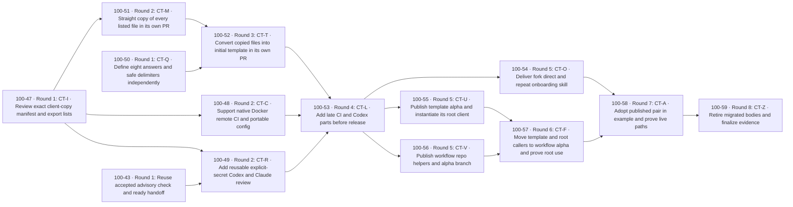

# Client template fan-out plan — 100-39

```yaml
project_code: client-template
project_color: pink
repository: 1000lines/symphony-example
base_branch: main
seed_issue: 100-39
target_project: Symphony client Copier template
human_lead: Jeremy Carroll
human_lead_github: jeremycarroll
human_lead_linear: c65b9fbe-e740-47e9-b444-3172d3526ff2
linear_issue_labels: [pink]
github_pr_labels: [pink, symphony]
```

Approved by Jeremy and merged September 11, 2026 in [PR #34](https://github.com/1000lines/symphony-example/pull/34)
at `873f511aea3e1d858e216d1a890ed1cd9a709d61`; 100-39 is Done.
[100-40](https://linear.app/1000lines/issue/100-40) created the thirteen tasks,
verified all seventeen direct blocker relations, then activated the set.
[Fan-out record and branch mapping](client-template/fan-out-100-40.md) links
the live issues. Payload keys remain stable manifest keys; graph labels now
carry the mapped Linear identifiers. Existing 100-43 retains Misc/blue and Done.

The result is a small client for Jeremy's shared host: build in the example,
publish the template and workflows separately, run the template repository as
its own Symphony client, then adopt the published pair back into the example.
The thirteen new tasks and one reused task require **eight
minimum dependency rounds**, counting nodes on the longest path, not elapsed
time or worker availability. Every task begins and opens its PR against `main`
in its explicitly named target repository. No predecessor branch is a PR base.

| Key    | Outcome / owned surface                                    | Estimated additions / deletions                               | Difficulty |
| ------ | ---------------------------------------------------------- | ------------------------------------------------------------- | ---------- |
| CT-I   | Four inventories and extraction boundaries                 | +180 / -0                                                     | easy       |
| 100-43 | Existing PR #31; advisory lifecycle and readiness          | Existing work; no new estimate or ticket                      | hard       |
| CT-C   | Existing config reader, CI/wakeup workflow and tests       | +450 / -220                                                   | hard       |
| CT-R   | Native review workflows, provider result and tests         | +650 / -350                                                   | hard       |
| CT-Q   | Eight answers, fixed delimiters and isolated render checks | +230 / -0                                                     | easy       |
| CT-M   | Exact copy of every reviewed client-list path              | +500–1,500 / -0, entirely copy                                | easy       |
| CT-T   | Convert copied files and test the initial template         | +300 / -400–1,300                                             | hard       |
| CT-L   | Add final CI/review callers and register render CI         | +170 / -50                                                    | hard       |
| CT-O   | One onboarding entry skill and fork/direct resources       | +240 / -0                                                     | hard       |
| CT-U   | Publish template and instantiate its own root client       | +850 / -0, primarily copy/render; explicit setup differences  | hard       |
| CT-V   | Reviewed workflow/helper export into public repository     | +2,000–5,000 / -0, primarily copy; ≤250 behavior/pin/CI lines | hard       |
| CT-F   | Migrate template/root callers to alpha and prove root use  | +180 / -60                                                    | hard       |
| CT-A   | Generated callers/config/guidance, proof, staging deletion | +250 / -650                                                   | hard       |
| CT-Z   | Evidence and obsolete bodies after consumer checks         | +100 / -500–1,500                                             | easy       |

Estimates include tests and docs, are not quotas, and must not motivate extra code.
CT-M may exceed 1,000 lines only as an exact whole-list copy; CT-T removes raw
bodies while introducing the template in a separate behavioral PR. CT-R is the
largest workflow behavior change; native execution and a small common result
keep one reviewable owner for the shared trigger. CT-V's larger diff is justified
only for copying the exact reviewed lists from CT-I/C/R. Selection or behavior
changes must be distinguished from that copy and reviewed before publication.

## Sources, precedence and assumptions

- Required [MVP source](https://linear.app/1000lines/document/hackathon-mvp-scope-client-template-source-c5a644291330): full Linear document
  `c69b0b0d-39fb-4b20-b7e9-1da1372b6863`, updated `2026-09-11T12:47:03.100Z`, read via injected GraphQL.
- Full [project brief](https://linear.app/1000lines/project/symphony-client-copier-template-0b2d70d81c4f)
  and current 100-39/100-40 seed context. The parent owns participant operation,
  credentials, host concurrency and the three-repo rehearsal; this plan owns
  skill artifacts and one owner-controlled walkthrough, not that wider rehearsal.
- [Human-approved merged design](https://github.com/1000lines/symphony-example/blob/99d401cf7653e4297569c29e62c4ec265fd84e1c/docs/symphony-plans/client-template-design.md),
  D1–D9 / AC1–AC13: PR #30 merged at `2026-09-11T13:33:50Z`, merge `99d401cf7653e4297569c29e62c4ec265fd84e1c`; 100-38 Done.
- Jeremy's [workflow publication](https://github.com/1000lines/symphony-example/pull/30#issuecomment-5634828727),
  [multi-project, skills and modes](https://github.com/1000lines/symphony-example/pull/30#issuecomment-5634926972),
  [accepted public-fork App](https://github.com/1000lines/symphony-example/pull/30#issuecomment-5634958976),
  [advisory check](https://github.com/1000lines/symphony-example/pull/30#issuecomment-5635132545)
  and [readiness](https://github.com/1000lines/symphony-example/pull/30#issuecomment-5635138859)
  comments read in full; GitHub readback confirms his admin access.
- Newer Linear history on 100-39 at `2026-09-11T13:40:02.547Z`, actor Jeremy Carroll,
  removes the 100-43 blocker and adds `related`; current relation readback agrees.
  This supersedes the design's requirement to wait before writing this plan.
  Do not restore that old blocker. Reuse 100-43 as a hard input to CT-R, where
  its merged source and initial live proof are actually consumed.
- [Jeremy's PR #34 decomposition decision](https://github.com/1000lines/symphony-example/pull/34#issuecomment-5635719306),
  September 11 at 14:12 UTC, supersedes the combined CT-T and its CT-C/R gate.
  Make list → straight copy → template conversion separate PRs, run the question
  package independently and integrate late Docker/Codex additions afterward.
  Verified GitHub admin authority; this revises the existing unaccepted plan,
  with no new planning seed or live downstream ticket.
- [Jeremy's parallel publication and alpha decision](https://github.com/1000lines/symphony-example/pull/34#pullrequestreview-5179855445),
  September 11 at 14:32 UTC, supersedes U → V serialization and immutable-only
  publication refs in this proposal and design D3. CT-U/V publish concurrently;
  both repositories expose moving `alpha` branches, and CT-F joins them. Main
  remains the task/PR base. Actual consumed SHAs remain validation provenance.
- [Jeremy's template self-use decision](https://github.com/1000lines/symphony-example/pull/34#issuecomment-5636188386),
  September 11 at 14:44 UTC, requires the template repository to develop through
  Symphony using its own generated root client. It strengthens the existing
  `_subdirectory: template` design: root development assets never render into
  participants. Choose `_envops` `[[ ]]` / `[% %]` now, and keep ordinary root
  lint/format away from raw templates while dedicated render checks remain
  mandatory. Verified admin authority supersedes CT-U's publication-only setup
  and CT-T's unspecified escaping; CT-U/F own initial and migrated root proof.
- [100-43 / PR #31](https://github.com/1000lines/symphony-example/pull/31): refreshed
  September 11, now Done; PR merged at 14:02:53Z as
  `ca5c37344df600468ee69e73c04c54197a5b062c`. CT-R still reads its workpad and
  verifies required initial live proof; Done alone is not execution evidence.
- Required baseline `3de96c9f739d732cc7efd498225b4444b547cc57` and selected main
  `99d401c` (initial); refreshed main `77b6b687e2213157ccfde75fef3867a4b886367c`
  and latest main `e14f398345bd9b7d30f00767bba1d00530ad73ce`
  retain the same team/CI contract. README, config, native workflow/AGENTS guidance, runtime WORKFLOW,
  package/toolchain, CI, review contract, shared [schema](fan-out-plan-schema.md),
  [criteria](fan-out-criteria.md), proof/PR/replan guidance and DAG APIs read.
  PR #29's inheritance workaround and closed/unmerged #24 are context only.
- Official [Copier configuration](https://copier.readthedocs.io/en/latest/configuring/)
  and [GitHub reusable workflows](https://docs.github.com/en/actions/how-tos/reuse-automations/reuse-workflows)
  read. Use ordinary Copier source/ref metadata and explicit per-hop secrets.

Required sources unavailable: **none**. Downloads and `orc-app` are optional.
No product decision remains open. Repository-name availability, grants, toolchain
versions and emitted CI provenance are execution lookups owned below, not invented
values or reasons to block independent preparation.

Two design statements need implementation precision. The existing reader requires
`ci.requiredChecks` entries with a verified check `appId`; prohibit credentials,
Linear project binding and installation IDs in config, not that check provenance.
Also, current wakeup YAML hardcodes `workflows: [CI]` / `workflow_id: ci.yml` and
ignores generic successful external checks. CT-C must make the existing path use
the target's actual required checks. AC8/AC12 already require compatibility; this
plan neither claims it exists nor commissions another controller.

## Breakdown and dependency rationale

The original combined CT-T offered ten new tasks/eight rounds, but mixed copying
with template behavior and waited for all Docker/Codex work. A fully serial
list/copy/questions/conversion plan would separate review but unnecessarily hold
question authoring. The chosen split has thirteen new tasks/eight rounds: CT-Q
owns package metadata/question tests in parallel with CT-I and CT-M's file work;
CT-M is only exact copying, then CT-T introduces the template. CT-C/R progress
alongside those lanes, and CT-L adds their completed interfaces before release.
Concurrent CT-U/V publication restores eight rounds while keeping three more
focused PRs than the original combined plan. Serial publication would take nine
rounds without a file/resource conflict to justify it; publishing workflows before
CT-L would omit the integrated caller/export readback. The large copy diff
contains no hidden changes.

The explicit preparation path is I → M → T. Q → T joins the independently
implemented eight-answer package only for the actual conversion/render tests.
Neither Q, M nor T waits on C/R; their later additions join at L. I/Q/M/C/R own
disjoint writable paths and isolated fixtures when unordered: copied source is
pinned and read-only even while C/R edit their own workflow sources. T takes M's
tree and Q's README/provenance only after both merges. L then takes T's tree/tests
and consumes C/R without editing their implementations. O/U/V are disjoint after L:
O writes the seed skill, U writes only the template repository and its alpha ref,
V writes only the workflow repository and its alpha ref. Shared source is read-only;
no task changes org-wide App grants or uses another lane's live proof PR.
No live shared secret or proof resource is used by Q/M/T/L.
The self-use revision keeps those boundaries: CT-Q owns package delimiters and
ignore configuration before CT-T converts anything; CT-U owns root instantiation
and initial proof in its destination, then CT-F takes both root and template
callers for migration and final proof. CT-U uses existing setup tools and the
accepted staged client, so it does not depend on the concurrently authored CT-O
skill or CT-V publication. CT-F's initial development can use root callers of
reviewed seed workflows. A separate self-use node would hand off the same files
again and add a round; combining it with these owners keeps each PR reviewable.

Every drawn edge is hard: its downstream outcome needs a reviewed artifact on the
selected base (or an accepted published ref), or relinquished write ownership.
L → V supplies the final integrated caller/export contract and completed C/R
work; U and V do not depend on each other. U → F and V → F are direct fan-in:
F edits the accepted template repository using the accepted workflow alpha ref.
O → A supplies the actual skill for its walkthrough. Transitive edges are omitted.
The longest path is I → M → T → L → U (or V) → F → A → Z, eight nodes. No no-op
joins. Both publications remain near project end, followed by final alpha
integration, real adoption and consumer-aware retirement.

## DAG



[Standalone matching graph](fan-out-plan-100-39-client-template.mmd).
Click directives are omitted because the existing shared DAG parser rejects them
as malformed Mermaid. Identifier labels remain in both graph copies; clickable
issue links are in the [fan-out record](client-template/fan-out-100-40.md).

## Manifest and branch declarations

The following is the branch manifest as well as the DAG manifest. `${issue}` is
replaced only with the real assigned identifier. CT-U/F target the template repo;
CT-V targets the workflow repo; all others target the example. The existing
100-43 branch/PR and Misc project/color are preserved, not relabeled or recreated.

```yaml
schema: symphony-dag-manifest/v1
project:
  code: client-template
  color: pink
  base_branch: main
  human_lead: Jeremy Carroll
  human_lead_github: jeremycarroll
  linear_issue_labels: [pink]
  github_pr_labels: [pink, symphony]
defaults:
  initial_state: Active
  maturity_label: mature
  task_branch_base: main
  task_pr_base: main
  task_pr_draft: true
  issue_assignee: Jeremy Carroll
  pr_assignee: jeremycarroll
  edge_semantics: direct_blocker_to_blocked
  relation_type: blocks
  mutation_policy: fail_closed
nodes:
  - id: I
    payload_key: CT-I
    title: Inventory client files and justify export lists
    type: task
    difficulty: easy
    labels: [pink]
    branch:
      template: symphony/client-template/${issue}/inventory
      base: main
      birth: on_dispatch
    pr:
      create: on_branch_birth
      base: main
      draft: true
      labels: [pink, symphony]
  - id: CHECK
    existing_issue: 100-43
    issue_id: 57d7cdf2-4283-4baa-8a36-5a1194615160
    title: Inherit advisory Cadence check and ready handoff
    type: existing_task
    difficulty: hard
    labels: [blue]
    branch:
      ref: symphony/misc/100-43/cadence-advisory-check
      base: main
      birth: existing
    pr:
      url: https://github.com/1000lines/symphony-example/pull/31
      base: main
      draft: true
      labels: [blue, symphony]
  - id: C
    payload_key: CT-C
    title: Support portable config and native Docker remote CI
    type: task
    difficulty: hard
    labels: [pink]
    branch:
      template: symphony/client-template/${issue}/compatibility
      base: main
      birth: on_dispatch
    pr:
      create: on_branch_birth
      base: main
      draft: true
      labels: [pink, symphony]
  - id: R
    payload_key: CT-R
    title: Make native review reusable with explicit secrets and Codex
    type: task
    difficulty: hard
    labels: [pink]
    branch:
      template: symphony/client-template/${issue}/review
      base: main
      birth: on_dispatch
    pr:
      create: on_branch_birth
      base: main
      draft: true
      labels: [pink, symphony]
  - id: Q
    payload_key: CT-Q
    title: Define eight Copier answers and safe delimiters
    type: task
    difficulty: easy
    labels: [pink]
    branch:
      template: symphony/client-template/${issue}/answers
      base: main
      birth: on_dispatch
    pr:
      create: on_branch_birth
      base: main
      draft: true
      labels: [pink, symphony]
  - id: M
    payload_key: CT-M
    title: Copy every listed client file without changes
    type: task
    difficulty: easy
    labels: [pink]
    branch:
      template: symphony/client-template/${issue}/copy
      base: main
      birth: on_dispatch
    pr:
      create: on_branch_birth
      base: main
      draft: true
      labels: [pink, symphony]
  - id: T
    payload_key: CT-T
    title: Convert the copied files into the initial template
    type: task
    difficulty: hard
    labels: [pink]
    branch:
      template: symphony/client-template/${issue}/template
      base: main
      birth: on_dispatch
    pr:
      create: on_branch_birth
      base: main
      draft: true
      labels: [pink, symphony]
  - id: L
    payload_key: CT-L
    title: Integrate late CI and Codex additions before release
    type: task
    difficulty: hard
    labels: [pink]
    branch:
      template: symphony/client-template/${issue}/integrate-template
      base: main
      birth: on_dispatch
    pr:
      create: on_branch_birth
      base: main
      draft: true
      labels: [pink, symphony]
  - id: O
    payload_key: CT-O
    title: Deliver fork direct and repeat onboarding skill
    type: task
    difficulty: hard
    labels: [pink]
    branch:
      template: symphony/client-template/${issue}/onboarding
      base: main
      birth: on_dispatch
    pr:
      create: on_branch_birth
      base: main
      draft: true
      labels: [pink, symphony]
  - id: U
    payload_key: CT-U
    title: Publish and instantiate the template repository
    type: task
    difficulty: hard
    labels: [pink]
    branch:
      template: symphony/client-template/${issue}/publish-template
      base: main
      birth: on_dispatch
    pr:
      create: on_branch_birth
      base: main
      draft: true
      labels: [pink, symphony]
  - id: V
    payload_key: CT-V
    title: Publish reusable workflows and required helpers
    type: task
    difficulty: hard
    labels: [pink]
    branch:
      template: symphony/client-template/${issue}/publish-workflows
      base: main
      birth: on_dispatch
    pr:
      create: on_branch_birth
      base: main
      draft: true
      labels: [pink, symphony]
  - id: F
    payload_key: CT-F
    title: Connect template and root clients to workflow alpha and prove use
    type: task
    difficulty: hard
    labels: [pink]
    branch:
      template: symphony/client-template/${issue}/release
      base: main
      birth: on_dispatch
    pr:
      create: on_branch_birth
      base: main
      draft: true
      labels: [pink, symphony]
  - id: A
    payload_key: CT-A
    title: Adopt published template and prove live consumer paths
    type: task
    difficulty: hard
    labels: [pink]
    branch:
      template: symphony/client-template/${issue}/adopt
      base: main
      birth: on_dispatch
    pr:
      create: on_branch_birth
      base: main
      draft: true
      labels: [pink, symphony]
  - id: Z
    payload_key: CT-Z
    title: Retire migrated bodies and finalize evidence
    type: task
    difficulty: easy
    labels: [pink]
    branch:
      template: symphony/client-template/${issue}/finalize
      base: main
      birth: on_dispatch
    pr:
      create: on_branch_birth
      base: main
      draft: true
      labels: [pink, symphony]
edges:
  - from: I
    to: M
  - from: I
    to: C
  - from: I
    to: R
  - from: CHECK
    to: R
  - from: M
    to: T
  - from: Q
    to: T
  - from: T
    to: L
  - from: C
    to: L
  - from: R
    to: L
  - from: L
    to: O
  - from: L
    to: U
  - from: L
    to: V
  - from: U
    to: F
  - from: V
    to: F
  - from: O
    to: A
  - from: F
    to: A
  - from: A
    to: Z
```

## Linear Relation Payloads

Resolve each key to its actual issue UUID after creation/reuse; then submit exactly
`{issueId: blockerUUID, relatedIssueId: blockedUUID, type: "blocks"}`. This table
and the graph/manifest have the same seventeen direct edges. The
[fan-out record](client-template/fan-out-100-40.md) resolves their live issues;
do not submit a placeholder or reverse an endpoint.

| Source    | issueId (blocker key) | relatedIssueId (blocked key) | type     |
| --------- | --------------------- | ---------------------------- | -------- |
| I → M     | `CT-I`                | `CT-M`                       | `blocks` |
| I → C     | `CT-I`                | `CT-C`                       | `blocks` |
| I → R     | `CT-I`                | `CT-R`                       | `blocks` |
| CHECK → R | `100-43`              | `CT-R`                       | `blocks` |
| M → T     | `CT-M`                | `CT-T`                       | `blocks` |
| Q → T     | `CT-Q`                | `CT-T`                       | `blocks` |
| T → L     | `CT-T`                | `CT-L`                       | `blocks` |
| C → L     | `CT-C`                | `CT-L`                       | `blocks` |
| R → L     | `CT-R`                | `CT-L`                       | `blocks` |
| L → O     | `CT-L`                | `CT-O`                       | `blocks` |
| L → U     | `CT-L`                | `CT-U`                       | `blocks` |
| L → V     | `CT-L`                | `CT-V`                       | `blocks` |
| U → F     | `CT-U`                | `CT-F`                       | `blocks` |
| V → F     | `CT-V`                | `CT-F`                       | `blocks` |
| O → A     | `CT-O`                | `CT-A`                       | `blocks` |
| F → A     | `CT-F`                | `CT-A`                       | `blocks` |
| A → Z     | `CT-A`                | `CT-Z`                       | `blocks` |

## Decisions

**September 11 client-skill correction:** [Jeremy's PR #44 comment](https://github.com/1000lines/symphony-example/pull/44#issuecomment-5638514034)
corrects #46's list placement: fourteen skill/resource paths belong in the
client template, not `ci-export.txt`. CT-M owns the two-list correction,
inventory/design/item reconciliation and exact 22-file copy in #44. CT-C is
already merged (#45), so this bounded correction has no concurrent list writer.
CT-T/L consume the enlarged client tree, CT-U publishes/renders it, CT-O loads
skills from that client, CT-A preserves existing skill collisions, and CT-V
excludes the fourteen paths. The fourteen nodes/seventeen hard edges and main/main
branches remain unchanged. The reviewed source pin is unchanged; human authority
supersedes the earlier CT-M inventory-edit exclusion for this correction only.

The [September 11, 16:30 reviewer-choice decision on PR #42](https://github.com/1000lines/symphony-example/pull/42#discussion_r3991277811)
amends D4/D6 and decisions 2/4 below with verified repository admin authority.
It adds `cadence_reviewer` as the eighth answer and supersedes key-presence
selection. This is a small interface revision within existing nodes: CT-Q asks
and tests, CT-R implements provider selection, CT-T/L integrate callers, and
CT-O/U/F/A consume/prove it. Node IDs, hard edges, branches and implementation
file ownership are unchanged. CT-L still requires the complete provider artifact;
the accepted App-identity-only checkpoint in PR #43 does not supply it.

1. **List, copy, conversion are separate PRs.** Jeremy's PR #34 decision is
   enforced by CT-I's fixed copy manifest, CT-M's byte/mode-identical copy and
   CT-T's template conversion. CT-Q owns the independent eight-answer package;
   CT-L integrates late CT-C/R additions before publication. CT-C/R update only
   their own export lists; CT-U/V compare against the final accepted lists.
2. **Keep native review and the existing ledger contract.** CT-R maps both
   providers into `cadence-review/v1` and the current feedback ledger, preserving
   requirement coverage, mandatory findings/human feedback, author checks,
   freshness and 100-43. D6's small provider result is an adapter input, not a
   replacement acceptance schema.
   `cadence_reviewer` explicitly selects Claude or Codex even with both keys
   present. Missing/invalid selection or a missing matching key fails early;
   API failures do not switch providers. No dormant controller is revived.
3. **Explicit least-secret boundaries.** CT-R/L/V/F map App, Linear and optional
   provider secrets at every review call; handoff has App/Linear; wakeups have
   Linear only; advisory cleanup has App only; CI and ingress have none.
   IDs/slugs are named config inputs. CT-R makes cleanup reusable; CT-I/L keep
   its native `workflow_run` listener local to each client and match actual
   caller workflow names. CT-C owns exposing the wakeup as `workflow_call`.
4. **Eight answers and many projects per repo.** CT-Q/T/L/O keep only repo slug,
   default branch, Linear team, two App slugs, `cadence_reviewer` (`claude`/`codex`,
   required with no default), build and test commands. Optional
   `ci.mode` belongs to existing config, not an additional question; project metadata
   comes from the issue. Preserve actual required-check name/workflow/App values.
5. **Native, client Dockerfile, remote.** CT-C implements the accepted existing
   reader/wakeup compatibility; CT-A proves real mode behavior and failure/recovery.
   Remote records missing tooling and publishes for mandatory CI. No new host
   orchestration, validator or compulsory host toolchain installation.
6. **Parallel publications on moving alpha branches.** CT-U/V publish separate
   repositories concurrently after CT-L. CT-F waits for both and updates template
   `alpha` to call workflow `@alpha`; CT-A proves the actual consumed pair. This
   implements Jeremy's 14:32 review and supersedes immutable-only D3 refs and the
   earlier U → V gate. Keep third-party Actions SHA-pinned. CT-Z retires old bodies
   only after a consumer census and replacement runs, updating standing guidance
   as paths move. Preserve historical commits, manual paths and needed forwarders.
7. **Onboarding is a small skill.** CT-O owns entry/fork/direct/repeat procedures;
   CT-A owns one owner-controlled walkthrough. Jeremy/parent owns installation,
   invocation, participant credentials and wider rehearsal. Public forks use the
   existing App with accepted contents/actions/metadata read and PR/issues/checks
   write authority across the installation. No new key service/isolation gate;
   direct/private adopters use owner-created Apps and separate guidance.
8. **Current-head human handoff.** Reuse 100-43; clean current-head verdict with
   no newer accepted feedback readies a draft, findings stay draft, already-ready
   PRs stay ready. `Cadence review` remains advisory, outside required CI and merge
   gates. No AI verdict authorizes merge or human acceptance.
9. **Clean main branches and explicit ownership.** All tasks use main/main;
   cross-repo publications use their own main. Hard predecessors must be accepted
   on that base/ref before dependent implementation; independent notes may still
   be published as drafts. No committed unmerged predecessor work.
10. **Reuse seeds and fail closed.** 100-38 is accepted design; 100-39 plans;
    existing 100-40 fans out; existing 100-43 supplies shared behavior. No duplicate
    advisory implementation, planning seed, validator or no-op join ticket.
11. **The template repository uses its own client.** Jeremy's 14:44 decision is
    enforced by CT-Q's fixed delimiters/CI boundary, CT-T/L's render tests,
    CT-U's concrete root instantiation and CT-F's real migrated Symphony/Codex
    proof. Root `copier.yml` selects `template/`; root workflows, instructions,
    config and answers are a consumer instance outside that output. CT-A still
    proves example adoption; CT-Z requires both consumer records before cleanup.

## Template layout and self-use contract

The staging package and published repository keep root `copier.yml` selecting
only `template/`. Root package tests/docs/CI are development assets. CT-U adds
concrete root client callers, instructions, `.symphony.cfg.json` and
`.copier-answers.yml` by rendering the reviewed client for its own repository;
the same names beneath `template/` remain generic source for participants.
Root-only content must never leak into generated repositories. CT-Q fixes this
configuration before CT-T introduces any placeholder:

```yaml
_subdirectory: template
_envops:
  variable_start_string: "[["
  variable_end_string: "]]"
  block_start_string: "[%"
  block_end_string: "%]"
  keep_trailing_newline: true
```

CT-Q/T/L render fixtures that substitute Copier values, preserve native GitHub
`${{ ... }}` expressions exactly, and exclude root-only sentinel files. Normal
root lint/format/test discovery excludes raw `template/` syntax; dedicated tests
still render it and validate generated workflow/config files on every affected
PR. Use existing formatter ignores and test commands, not a custom validator.
CT-U/F preserve that distinction in the published repo's required CI.

CT-U's initial root client uses reviewed seed workflows; after trusted activation,
a follow-up Symphony PR proves it works before CT-F develops the migration.
CT-F repoints both the source template and root instance to workflow `@alpha`,
then proves a real template-development PR through those migrated callers and
records it in `SELF-ADOPTION.md`/workpad. Bootstrap/pre-merge renders are not live
review evidence. CT-A retains the separate published-template adoption into the
example. These are two real consumers, with disjoint repository/PR resources;
CT-Z's census must cover both before removing seed workflow bodies.

The additional operational proof is an accepted cost of Jeremy's self-use
requirement. Keep root setup small, reuse generated files and existing tools,
and preserve working seed references until replacements pass. No recursive
Copier hook, automatic update system or self-referential commit pin is needed.

## Alpha publication and evidence contract

`alpha` is the moving publication branch in both new repositories, not a tag or
an alternative task/PR base. CT-U/V create or advance only their destination's
`refs/heads/alpha` to human-accepted code from its main; CT-F later owns advances
of template alpha. Use normal reviewed ref updates and preserve existing work.
A same-name tag would shadow a branch in GitHub workflow calls; verify no `alpha`
tag collision and report a real collision rather than silently deleting it.

Generated final callers use literal
`1000lines/symphony-client-workflows/.github/workflows/<file>@alpha`.
Onboarding/rendering uses `copier copy --vcs-ref=alpha <template-git-url> <target>`;
this is an operator argument, not an additional answer or a `copier.yml` setting.
Preserve ordinary `_src_path`/`_commit`; separately record the actual template
commit, workflow source commits and trusted helper checkout commits used by a
run. Same-repository nested calls may use native same-commit references. Helper
checkouts must use trusted workflow-source code, never the target PR's SHA.

The accepted tradeoff is that alpha can change without regenerating a consumer.
Evidence applies to the recorded commits/run, not every later branch tip. CT-U/V/F
record ref resolution at publication; CT-A records actual consumed commits during
live proof, including any movement. If movement changes the tested combination,
rerun the affected proof; do not claim the previous run validates the new tips.
No tag release, automatic ref updater, new gate or immutable-consumer policy is
commissioned. Existing human review and mandatory current-head CI still apply.

## Ticket source and execution contract

Copy this section, the layout/self-use and Alpha publication/evidence contracts above, the item's
complete section and its incoming relation rows
into every generated description. The per-task files are part of this plan:

- [CT-I/Q/M/C/R/T/L/O: implementation items](client-template/implementation-items.md).
- [100-43 and CT-U/V/F/A/Z: delivery and reuse items](client-template/delivery-items.md).
- [Validation and dry-run rendering](client-template/plan-validation.md).

Use the item's explicit repository override when opening a publication task.
Set project `client-template`, assignee Jeremy and Linear `pink`; each new PR
requires `symphony` and `pink`, assigned `jeremycarroll`. Difficulty is descriptive,
not an invented Linear label. The reused 100-43 retains Misc/blue and its owner.

Before live fan-out, 100-40 resolves states Backlog/Active/Inactive/Unhappy/Evaluating,
labels pink/mature/wake:15m, both GitHub labels in each actual destination, assignee,
selected branch refs, existing issue/PR associations and every relation endpoint.
Missing or conflicting values fail closed before affected writes. Do not create
labels or expand credentials to make a preflight pass. If a new publication repo
is absent, its future owner creates/verifies it during its task; that absence
gates only destination operations, not unrelated ticket creation.

Generate temporarily in Backlog, record actual IDs, create/read back exactly the
hard relations, and only then move all new tickets to Active unless Jeremy asks
for a hold. Preserve terminal/existing issues. Verify the complete DAG before
activation; on partial failure leave staged issues parked, record exact IDs and
resume without duplicates. Blocking is a relation property, never a workflow
status. 100-39 creates none of these tickets.

Open each PR draft against main. Use `[<issue>]: <brief-title>`, a short business
purpose, linked current progress diagram, selected base and actual evidence.
Validate **local → Docker if needed → mandatory current-head CI**, even docs-only
changes. Run the item's targeted commands, then the target's required checks;
fix actionable failures before publication. Passing local checks means
`Docker: skipped — passed locally`. For a host environment gap, use its documented
container or a pinned compatible image, recording digest, command and result.
Mount only the issue workspace, use its UID/GID, remove task containers and do
not publish ports. The specifically accepted remote mode instead runs available
checks, records missing tools and hands the prepared head to GitHub CI; it does
not call skipped tests passes or waive known failures.

Seed CI is `CI Required` / `.github/workflows/ci.yml` / GitHub Actions App `15368`,
with build, lint, test and Changed Markdown children. CT-Q creates render CI; CT-L registers the completed template check.
Publication repos must carry reviewed CI for the actual package, discover its
real check/workflow/App provenance and record required checks before activation;
never assume seed job names are universal. Record target SHA, local commands,
container skip/digest, workflow/event/ref/run/attempt and required child results,
artifacts, acceptance criterion, limitations and next owner per the proof standard.

Pending/missing CI: Unhappy + wake:15m; failed current-head CI/conflict: Active;
passed CI waiting for review/operator: Inactive without wake:15m. Recheck head and
issue state before mutations and preserve newer/terminal state. Cadence findings
with known fixes are rework; missing access gates only dependent work. For an
unavailable admin operation, deliver its reviewable PR first and name repository,
App, exact failed operation, required permission, Jeremy/target-owner action and
readback. Do not claim deployment from source or bundle fixtures.

Set blocker-side `mature` only after required CI and configured Cadence approve
the current head, mandatory feedback is closed, branch contains no unmerged
predecessor work and PR is ready. Record reviewer, SHA, verdict and workpad;
inspect new human feedback before handoff. Remove only for request-changes,
rejected/stale acceptance evidence or comparably severe regression, not ordinary
edits alone. An unsatisfied hard artifact/merge dependency still pauses dependent
implementation even if the runtime dispatches on maturity. Planning seeds cannot
be mature before human approval and merge. Human acceptance owns Done; this plan
authorizes no merge or admin override.

## Completion gates

CT-Z must account for every design AC: CT-I/M/Q/T/L (AC1/2), CT-R/L (AC3/4), CT-R early
and CT-A final real Codex review (AC5), CT-U (AC6), CT-A (AC7), CT-C/L/A (AC8),
CT-O/A (AC9), all delivery owners (AC10), CT-V/F/A (AC11), CT-C/A (AC12), and
100-43 plus CT-R/V/A (AC13). Missing live evidence leaves the responsible delivery
open; it cannot be relabeled as a documentation pass.
Jeremy's 14:44 additions also require CT-Q/T/L's expression/leakage/CI checks,
CT-U's operational root instance and CT-F's migrated template-development proof;
these extend AC1/2/5/6/11/13, rather than replacing CT-A's original evidence.

No project completion until both public refs resolve, final consumers run those
refs in both the template root and example, mandatory CI/review and
owner-controlled onboarding/mode evidence exist,
staging is gone, old entry points are retained or retired with consumer evidence,
and project-scoped temporary work is resolved. Preserve historical plans as dated
records. Parent rehearsal/concurrency, application deployments, Terraform,
`copier update`, upstream submission and new shared process machinery are excluded.
