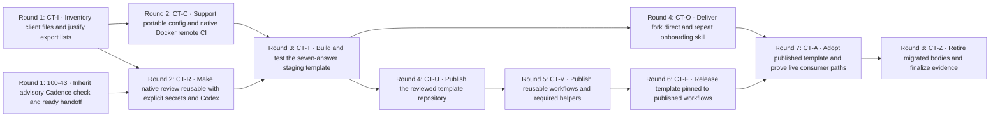

# Client template fan-out plan — 100-39

```yaml
project_code: client-template
project_color: pink
repository: 1000lines/symphony-example
base_branch: main
seed_issue: 100-39
target_project: Symphony client Copier template
human_lead: Jeremy Carroll
human_lead_github: jeremycarroll
human_lead_linear: c65b9fbe-e740-47e9-b444-3172d3526ff2
linear_issue_labels: [pink]
github_pr_labels: [pink, symphony]
```

Proposed September 11, 2026 for human review. This ticket publishes a plan only.
[100-40](https://linear.app/1000lines/issue/100-40) applies it only after Jeremy
approves and merges this plan and 100-39 is Done. No downstream issue exists yet
except the reused 100-43. Payload keys below are placeholders, never Linear IDs.

The result is a small client for Jeremy's shared host: build in the example,
publish the template and workflows separately, then adopt the published pair
back into the example. The ten new tasks and one reused task require **eight
minimum dependency rounds**, counting nodes on the longest path, not elapsed
time or worker availability. Every task begins and opens its PR against `main`
in its explicitly named target repository. No predecessor branch is a PR base.

| Key    | Outcome / owned surface                                    | Estimated additions / deletions                               | Difficulty |
| ------ | ---------------------------------------------------------- | ------------------------------------------------------------- | ---------- |
| CT-I   | Three inventories and extraction boundaries                | +180 / -0                                                     | easy       |
| 100-43 | Existing PR #31; advisory lifecycle and readiness          | Existing work; no new estimate or ticket                      | hard       |
| CT-C   | Existing config reader, CI/wakeup workflow and tests       | +450 / -220                                                   | hard       |
| CT-R   | Native review workflows, provider result and tests         | +650 / -350                                                   | hard       |
| CT-T   | Staging root, render tests and seed CI caller              | +650 / -0                                                     | hard       |
| CT-O   | One onboarding entry skill and fork/direct resources       | +240 / -0                                                     | hard       |
| CT-U   | Whole reviewed template root into public repository        | +650 / -0, primarily copy                                     | easy       |
| CT-V   | Reviewed workflow/helper export into public repository     | +2,000–5,000 / -0, primarily copy; ≤250 behavior/pin/CI lines | hard       |
| CT-F   | Final workflow pins and release provenance                 | +60 / -30                                                     | easy       |
| CT-A   | Generated callers/config/guidance, proof, staging deletion | +250 / -650                                                   | hard       |
| CT-Z   | Evidence and obsolete bodies after consumer checks         | +100 / -500–1,500                                             | easy       |

Estimates include tests and docs, are not quotas, and must not motivate extra code.
CT-R is the largest behavioral change; native execution and a small common result
keep one reviewable owner for the shared trigger. CT-V's larger diff is justified
only for copying the exact reviewed lists from CT-I/C/R. Selection or behavior
changes must be distinguished from that copy and reviewed before publication.

## Sources, precedence and assumptions

- Required [MVP source](https://linear.app/1000lines/document/hackathon-mvp-scope-client-template-source-c5a644291330): full Linear document
  `c69b0b0d-39fb-4b20-b7e9-1da1372b6863`, updated `2026-09-11T12:47:03.100Z`, read via injected GraphQL.
- Full [project brief](https://linear.app/1000lines/project/symphony-client-copier-template-0b2d70d81c4f)
  and current 100-39/100-40 seed context. The parent owns participant operation,
  credentials, host concurrency and the three-repo rehearsal; this plan owns
  skill artifacts and one owner-controlled walkthrough, not that wider rehearsal.
- [Human-approved merged design](https://github.com/1000lines/symphony-example/blob/99d401cf7653e4297569c29e62c4ec265fd84e1c/docs/symphony-plans/client-template-design.md),
  D1–D9 / AC1–AC13: PR #30 merged at `2026-09-11T13:33:50Z`, merge `99d401cf7653e4297569c29e62c4ec265fd84e1c`; 100-38 Done.
- Jeremy's [workflow publication](https://github.com/1000lines/symphony-example/pull/30#issuecomment-5634828727),
  [multi-project, skills and modes](https://github.com/1000lines/symphony-example/pull/30#issuecomment-5634926972),
  [accepted public-fork App](https://github.com/1000lines/symphony-example/pull/30#issuecomment-5634958976),
  [advisory check](https://github.com/1000lines/symphony-example/pull/30#issuecomment-5635132545)
  and [readiness](https://github.com/1000lines/symphony-example/pull/30#issuecomment-5635138859)
  comments read in full; GitHub readback confirms his admin access.
- Newer Linear history on 100-39 at `2026-09-11T13:40:02.547Z`, actor Jeremy Carroll,
  removes the 100-43 blocker and adds `related`; current relation readback agrees.
  This supersedes the design's requirement to wait before writing this plan.
  Do not restore that old blocker. Reuse 100-43 as a hard input to CT-R, where
  its merged source and initial live proof are actually consumed.
- [100-43 / PR #31](https://github.com/1000lines/symphony-example/pull/31): at planning,
  Inactive, open draft, source head `36f5bb6b6b02e64e721f9cbbd6e7b8948661b4db`.
  CI passed; Cadence and post-merge live proof are pending. This is context,
  not accepted source to copy or proof to reuse as completed.
- Required baseline `3de96c9f739d732cc7efd498225b4444b547cc57` and selected main
  `99d401c`: README, config, native workflow/AGENTS guidance, runtime WORKFLOW,
  package/toolchain, CI, review contract, shared [schema](fan-out-plan-schema.md),
  [criteria](fan-out-criteria.md), proof/PR/replan guidance and DAG APIs read.
  PR #29's inheritance workaround and closed/unmerged #24 are context only.
- Official [Copier configuration](https://copier.readthedocs.io/en/latest/configuring/)
  and [GitHub reusable workflows](https://docs.github.com/en/actions/how-tos/reuse-automations/reuse-workflows)
  read. Use ordinary Copier source/ref metadata and explicit per-hop secrets.

Required sources unavailable: **none**. Downloads and `orc-app` are optional.
No product decision remains open. Repository-name availability, grants, toolchain
versions and emitted CI provenance are execution lookups owned below, not invented
values or reasons to block independent preparation.

Two design statements need implementation precision. The existing reader requires
`ci.requiredChecks` entries with a verified check `appId`; prohibit credentials,
Linear project binding and installation IDs in config, not that check provenance.
Also, current wakeup YAML hardcodes `workflows: [CI]` / `workflow_id: ci.yml` and
ignores generic successful external checks. CT-C must make the existing path use
the target's actual required checks. AC8/AC12 already require compatibility; this
plan neither claims it exists nor commissions another controller.

## Breakdown and dependency rationale

A single template/publication PR would entangle provider execution, credential
routing, host-reader compatibility and two publish destinations. A fully serial
plan would avoid overlap but delay independent CI and review work. The chosen
DAG splits those files after a short inventory, then composes them in CT-T.
Onboarding source work and template publication can proceed together. Workflow
publication follows the first template publication to honor the near-end move;
final pins and live adoption follow both. CT-Z owns only evidence closure and
retirement that cannot be justified before replacement consumer runs pass.

Every drawn edge is hard: its downstream outcome needs a reviewed artifact on the
selected base (or an accepted published ref), or relinquished write ownership.
CT-U → CT-V also enforces the human-requested publication order. CT-O → CT-A
supplies the actual skill for its walkthrough. Transitive edges are omitted.
The longest paths are I/CHECK → R → T → U → V → F → A → Z. No no-op join nodes.
Read-only shared source/API inspection does not conflict. Mutable resources and
same-file handoffs are listed in each item; ordinary PR/branch resources are
unique per generated ticket.

## DAG



[Standalone matching graph](fan-out-plan-100-39-client-template.mmd).

## Manifest and branch declarations

The following is the branch manifest as well as the DAG manifest. `${issue}` is
replaced only with the real assigned identifier. CT-U/F target the template repo;
CT-V targets the workflow repo; all others target the example. The existing
100-43 branch/PR and Misc project/color are preserved, not relabeled or recreated.

```yaml
schema: symphony-dag-manifest/v1
project:
  code: client-template
  color: pink
  base_branch: main
  human_lead: Jeremy Carroll
  human_lead_github: jeremycarroll
  linear_issue_labels: [pink]
  github_pr_labels: [pink, symphony]
defaults:
  initial_state: Active
  maturity_label: mature
  task_branch_base: main
  task_pr_base: main
  task_pr_draft: true
  issue_assignee: Jeremy Carroll
  pr_assignee: jeremycarroll
  edge_semantics: direct_blocker_to_blocked
  relation_type: blocks
  mutation_policy: fail_closed
nodes:
  - id: I
    payload_key: CT-I
    title: Inventory client files and justify export lists
    type: task
    difficulty: easy
    labels: [pink]
    branch:
      template: symphony/client-template/${issue}/inventory
      base: main
      birth: on_dispatch
    pr:
      create: on_branch_birth
      base: main
      draft: true
      labels: [pink, symphony]
  - id: CHECK
    existing_issue: 100-43
    issue_id: 57d7cdf2-4283-4baa-8a36-5a1194615160
    title: Inherit advisory Cadence check and ready handoff
    type: existing_task
    difficulty: hard
    labels: [blue]
    branch:
      ref: symphony/misc/100-43/cadence-advisory-check
      base: main
      birth: existing
    pr:
      url: https://github.com/1000lines/symphony-example/pull/31
      base: main
      draft: true
      labels: [blue, symphony]
  - id: C
    payload_key: CT-C
    title: Support portable config and native Docker remote CI
    type: task
    difficulty: hard
    labels: [pink]
    branch:
      template: symphony/client-template/${issue}/compatibility
      base: main
      birth: on_dispatch
    pr:
      create: on_branch_birth
      base: main
      draft: true
      labels: [pink, symphony]
  - id: R
    payload_key: CT-R
    title: Make native review reusable with explicit secrets and Codex
    type: task
    difficulty: hard
    labels: [pink]
    branch:
      template: symphony/client-template/${issue}/review
      base: main
      birth: on_dispatch
    pr:
      create: on_branch_birth
      base: main
      draft: true
      labels: [pink, symphony]
  - id: T
    payload_key: CT-T
    title: Build and test the seven-answer staging template
    type: task
    difficulty: hard
    labels: [pink]
    branch:
      template: symphony/client-template/${issue}/template
      base: main
      birth: on_dispatch
    pr:
      create: on_branch_birth
      base: main
      draft: true
      labels: [pink, symphony]
  - id: O
    payload_key: CT-O
    title: Deliver fork direct and repeat onboarding skill
    type: task
    difficulty: hard
    labels: [pink]
    branch:
      template: symphony/client-template/${issue}/onboarding
      base: main
      birth: on_dispatch
    pr:
      create: on_branch_birth
      base: main
      draft: true
      labels: [pink, symphony]
  - id: U
    payload_key: CT-U
    title: Publish the reviewed template repository
    type: task
    difficulty: easy
    labels: [pink]
    branch:
      template: symphony/client-template/${issue}/publish-template
      base: main
      birth: on_dispatch
    pr:
      create: on_branch_birth
      base: main
      draft: true
      labels: [pink, symphony]
  - id: V
    payload_key: CT-V
    title: Publish reusable workflows and required helpers
    type: task
    difficulty: hard
    labels: [pink]
    branch:
      template: symphony/client-template/${issue}/publish-workflows
      base: main
      birth: on_dispatch
    pr:
      create: on_branch_birth
      base: main
      draft: true
      labels: [pink, symphony]
  - id: F
    payload_key: CT-F
    title: Release template pinned to published workflows
    type: task
    difficulty: easy
    labels: [pink]
    branch:
      template: symphony/client-template/${issue}/release
      base: main
      birth: on_dispatch
    pr:
      create: on_branch_birth
      base: main
      draft: true
      labels: [pink, symphony]
  - id: A
    payload_key: CT-A
    title: Adopt published template and prove live consumer paths
    type: task
    difficulty: hard
    labels: [pink]
    branch:
      template: symphony/client-template/${issue}/adopt
      base: main
      birth: on_dispatch
    pr:
      create: on_branch_birth
      base: main
      draft: true
      labels: [pink, symphony]
  - id: Z
    payload_key: CT-Z
    title: Retire migrated bodies and finalize evidence
    type: task
    difficulty: easy
    labels: [pink]
    branch:
      template: symphony/client-template/${issue}/finalize
      base: main
      birth: on_dispatch
    pr:
      create: on_branch_birth
      base: main
      draft: true
      labels: [pink, symphony]
edges:
  - from: I
    to: C
  - from: I
    to: R
  - from: CHECK
    to: R
  - from: C
    to: T
  - from: R
    to: T
  - from: T
    to: O
  - from: T
    to: U
  - from: U
    to: V
  - from: V
    to: F
  - from: O
    to: A
  - from: F
    to: A
  - from: A
    to: Z
```

## Linear Relation Payloads

Resolve each key to its actual issue UUID after creation/reuse; then submit exactly
`{issueId: blockerUUID, relatedIssueId: blockedUUID, type: "blocks"}`. This table
and the graph/manifest have the same twelve direct edges. There are no live UUIDs
for future tasks yet; do not submit a placeholder or reverse an endpoint.

| Source    | issueId (blocker key) | relatedIssueId (blocked key) | type     |
| --------- | --------------------- | ---------------------------- | -------- |
| I → C     | `CT-I`                | `CT-C`                       | `blocks` |
| I → R     | `CT-I`                | `CT-R`                       | `blocks` |
| CHECK → R | `100-43`              | `CT-R`                       | `blocks` |
| C → T     | `CT-C`                | `CT-T`                       | `blocks` |
| R → T     | `CT-R`                | `CT-T`                       | `blocks` |
| T → O     | `CT-T`                | `CT-O`                       | `blocks` |
| T → U     | `CT-T`                | `CT-U`                       | `blocks` |
| U → V     | `CT-U`                | `CT-V`                       | `blocks` |
| V → F     | `CT-V`                | `CT-F`                       | `blocks` |
| O → A     | `CT-O`                | `CT-A`                       | `blocks` |
| F → A     | `CT-F`                | `CT-A`                       | `blocks` |
| A → Z     | `CT-A`                | `CT-Z`                       | `blocks` |

## Decisions

1. **Inventory before generation or copying.** CT-I justifies exact paths; CT-C/R
   update only their own export list. CT-T/U/V compare against those lists.
2. **Keep native review and one small verdict.** CT-R wires Codex/Claude into the
   existing workflow, preserving author checks, freshness, feedback and 100-43.
   OpenAI wins when present; Anthropic alone selects Claude; neither fails early.
   API failures do not switch providers. No dormant controller is revived.
3. **Explicit least-secret boundaries.** CT-R/T/V/F map App, Linear and optional
   provider secrets at every review call; handoff has App/Linear; wakeups have
   Linear only; CI and ingress have none. IDs/slugs are named config inputs.
4. **Seven answers and many projects per repo.** CT-C/T/O keep only repo slug,
   default branch, Linear team, two App slugs, build and test commands. Optional
   `ci.mode` belongs to existing config, not an eighth question; project metadata
   comes from the issue. Preserve actual required-check name/workflow/App values.
5. **Native, client Dockerfile, remote.** CT-C implements the accepted existing
   reader/wakeup compatibility; CT-A proves real mode behavior and failure/recovery.
   Remote records missing tooling and publishes for mandatory CI. No new host
   orchestration, validator or compulsory host toolchain installation.
6. **Two public repositories and final proof.** CT-U publishes template content;
   CT-V publishes workflows/helpers; CT-F releases final pins; CT-A proves that
   exact pair. CT-Z retires old bodies only after a consumer census and replacement
   runs. Preserve historical refs, manual paths and needed forwarders.
7. **Onboarding is a small skill.** CT-O owns entry/fork/direct/repeat procedures;
   CT-A owns one owner-controlled walkthrough. Jeremy/parent owns installation,
   invocation, participant credentials and wider rehearsal. Public forks use the
   existing App with accepted contents/actions/metadata read and PR/issues/checks
   write authority across the installation. No new key service/isolation gate;
   direct/private adopters use owner-created Apps and separate guidance.
8. **Current-head human handoff.** Reuse 100-43; clean current-head verdict with
   no newer accepted feedback readies a draft, findings stay draft, already-ready
   PRs stay ready. `Cadence review` remains advisory, outside required CI and merge
   gates. No AI verdict authorizes merge or human acceptance.
9. **Clean main branches and explicit ownership.** All tasks use main/main;
   cross-repo publications use their own main. Hard predecessors must be accepted
   on that base/ref before dependent implementation; independent notes may still
   be published as drafts. No committed unmerged predecessor work.
10. **Reuse seeds and fail closed.** 100-38 is accepted design; 100-39 plans;
    existing 100-40 fans out; existing 100-43 supplies shared behavior. No duplicate
    advisory implementation, planning seed, validator or no-op join ticket.

## Ticket source and execution contract

Copy this section, the item's complete section and its incoming relation rows
into every generated description. The per-task files are part of this plan:

- [CT-I/C/R/T/O: implementation items](client-template/implementation-items.md).
- [100-43 and CT-U/V/F/A/Z: delivery and reuse items](client-template/delivery-items.md).
- [Validation and dry-run rendering](client-template/plan-validation.md).

Use the item's explicit repository override when opening a publication task.
Set project `client-template`, assignee Jeremy and Linear `pink`; each new PR
requires `symphony` and `pink`, assigned `jeremycarroll`. Difficulty is descriptive,
not an invented Linear label. The reused 100-43 retains Misc/blue and its owner.

Before live fan-out, 100-40 resolves states Backlog/Active/Inactive/Unhappy/Evaluating,
labels pink/mature/wake:15m, both GitHub labels in each actual destination, assignee,
selected branch refs, existing issue/PR associations and every relation endpoint.
Missing or conflicting values fail closed before affected writes. Do not create
labels or expand credentials to make a preflight pass. If a new publication repo
is absent, its future owner creates/verifies it during its task; that absence
gates only destination operations, not unrelated ticket creation.

Generate temporarily in Backlog, record actual IDs, create/read back exactly the
hard relations, and only then move all new tickets to Active unless Jeremy asks
for a hold. Preserve terminal/existing issues. Verify the complete DAG before
activation; on partial failure leave staged issues parked, record exact IDs and
resume without duplicates. Blocking is a relation property, never a workflow
status. 100-39 creates none of these tickets.

Open each PR draft against main. Use `[<issue>]: <brief-title>`, a short business
purpose, linked current progress diagram, selected base and actual evidence.
Validate **local → Docker if needed → mandatory current-head CI**, even docs-only
changes. Run the item's targeted commands, then the target's required checks;
fix actionable failures before publication. Passing local checks means
`Docker: skipped — passed locally`. For a host environment gap, use its documented
container or a pinned compatible image, recording digest, command and result.
Mount only the issue workspace, use its UID/GID, remove task containers and do
not publish ports. The specifically accepted remote mode instead runs available
checks, records missing tools and hands the prepared head to GitHub CI; it does
not call skipped tests passes or waive known failures.

Seed CI is `CI Required` / `.github/workflows/ci.yml` / GitHub Actions App `15368`,
with build, lint, test and Changed Markdown children. CT-T adds its render check.
Publication repos must carry reviewed CI for the actual package, discover its
real check/workflow/App provenance and record required checks before activation;
never assume seed job names are universal. Record target SHA, local commands,
container skip/digest, workflow/event/ref/run/attempt and required child results,
artifacts, acceptance criterion, limitations and next owner per the proof standard.

Pending/missing CI: Unhappy + wake:15m; failed current-head CI/conflict: Active;
passed CI waiting for review/operator: Inactive without wake:15m. Recheck head and
issue state before mutations and preserve newer/terminal state. Cadence findings
with known fixes are rework; missing access gates only dependent work. For an
unavailable admin operation, deliver its reviewable PR first and name repository,
App, exact failed operation, required permission, Jeremy/target-owner action and
readback. Do not claim deployment from source or bundle fixtures.

Set blocker-side `mature` only after required CI and configured Cadence approve
the current head, mandatory feedback is closed, branch contains no unmerged
predecessor work and PR is ready. Record reviewer, SHA, verdict and workpad;
inspect new human feedback before handoff. Remove only for request-changes,
rejected/stale acceptance evidence or comparably severe regression, not ordinary
edits alone. An unsatisfied hard artifact/merge dependency still pauses dependent
implementation even if the runtime dispatches on maturity. Planning seeds cannot
be mature before human approval and merge. Human acceptance owns Done; this plan
authorizes no merge or admin override.

## Completion gates

CT-Z must account for every design AC: CT-I/T (AC1/2), CT-R/T (AC3/4), CT-R early
and CT-A final real Codex review (AC5), CT-U (AC6), CT-A (AC7), CT-C/T/A (AC8),
CT-O/A (AC9), all delivery owners (AC10), CT-V/F/A (AC11), CT-C/A (AC12), and
100-43 plus CT-R/V/A (AC13). Missing live evidence leaves the responsible delivery
open; it cannot be relabeled as a documentation pass.

No project completion until both public refs resolve, final consumers run those
refs, mandatory CI/review and owner-controlled onboarding/mode evidence exist,
staging is gone, old entry points are retained or retired with consumer evidence,
and project-scoped temporary work is resolved. Preserve historical plans as dated
records. Parent rehearsal/concurrency, application deployments, Terraform,
`copier update`, upstream submission and new shared process machinery are excluded.
