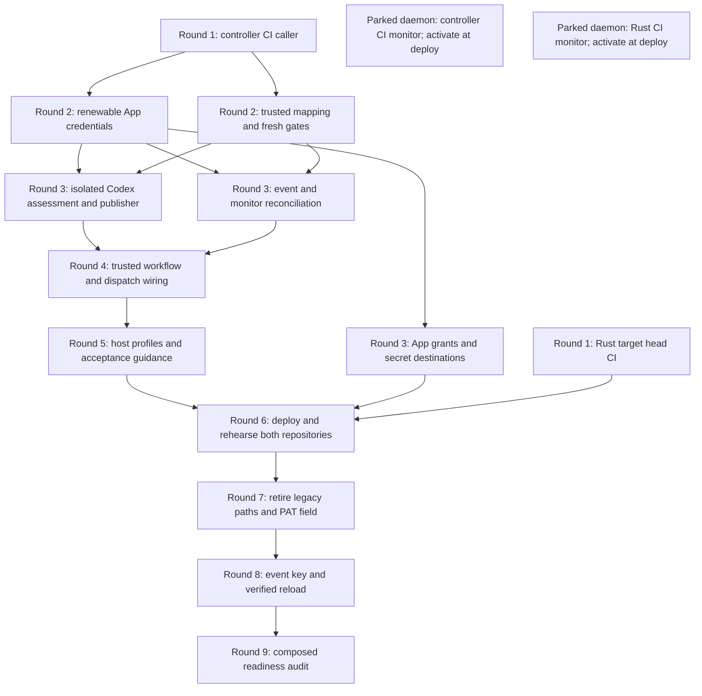

# Hackathon readiness fan-out plan

Planning issue: [100-7](https://linear.app/1000lines/issue/100-7/plan-project-seed-ticket).
Status: proposed for human PR review. No implementation issues are created by
this artifact. [100-8](https://linear.app/1000lines/issue/100-8/trigger-fan-out)
alone creates the accepted issue set after this plan is accepted and merged.

Project: `hackathon-ready`; color: `pink`; base branch: `main`; human lead:
Jeremy Carroll (`jeremycarroll`, Linear `c65b9fbe-e740-47e9-b444-3172d3526ff2`).
Linear project: `85af4ee2-fc0e-4291-bdbb-db3f6f0e83f7`; team `100`:
`2d7d1d7e-47ff-45d2-8097-19307ad5a589`. Controller:
`1000lines/symphony-example`; selected target: `jeremycarroll/venn-search-rs`,
repository ID `1076114173`. No `1000lines/symphony` code change is planned.

## Sources and boundaries

- Read live issue, project content, comments, seed relations and project issues
  on September 9, 2026. Reuse the existing three seeds: 100-6 is Done; 100-7
  owns this plan; 100-8 owns fan-out. Do not generate replacements or additional
  planning seeds. No existing implementation, deploy or finalize issue was found.
- Read the [canonical brief](https://github.com/1000lines/symphony-example/blob/9673504cfc0c96e11a8de79c9a0247ec53827f7f/docs/symphony-plans/hackathon-ready-brief.md).
  Its fetched SHA-256 is
  `f742ed757d816c7b4be31f1b9435ce0589a694dcd9c6d6b47520e66e832081da`.
- Read the [accepted design and subsequent validation clarification](https://github.com/1000lines/symphony-example/blob/dc71026c35b7fc97f58e54cd03ce7fe513621e1f/docs/symphony-plans/hackathon-ready-design.md).
  Jeremy merged design PR #2 at `e4daab77ca250489bb66f81bf2842190874f4945`.
  The planning baseline is `main@dc71026c35b7fc97f58e54cd03ce7fe513621e1f`,
  including the later local → Docker if needed → mandatory CI clarification.
- Read planning README/schema/criteria, shared DAG parser and renderer,
  MIGRATION.md, both WORKFLOW.md profiles, project-workflow.md and proof-of-work.md;
  inspected current Cadence event/execution/handoff, CI/wakeup workflows and
  credential integration points. These identify current behavior, not rollout proof.
- Read runtime daemon/schema at
  `1000lines/symphony@e4d3f6a05b0a00201c9d04d3ceca02b206e22de5`, the selected Rust
  CI at `99528c2e4da241ec2c9961d0a155357611f16a76`, pinned Codex Action source,
  [official Codex Action guidance](https://learn.chatgpt.com/docs/github-action),
  [App permissions](https://docs.github.com/en/apps/creating-github-apps/registering-a-github-app/choosing-permissions-for-a-github-app)
  and [check runs](https://docs.github.com/en/rest/checks/runs).
- No required source is unavailable. Installation IDs/grants, actual emitted
  controller check names, monitor IDs and compatibility are verification inputs
  with owners below. They are not invented values or further product questions.

The [execution contract](hackathon-ready/execution-contract.md) is part of this
plan. Copy its common ticket rules and each node's fields into generated bodies.
The [validation record](hackathon-ready/plan-validation.md) describes how to
inspect payloads using existing tooling and its actual limitations.

## Decomposition

Three outcome-sized PRs (review, Apps, CI) would repeatedly edit credential,
workflow and handoff files and make each integration diff several thousand
lines. A file-by-file split would create many small tickets but leave shared
contracts and rollout sequencing scattered across more than twenty reviews.
The selected thirteen delivery tasks plus two persistent monitor issues give
one owner to each shared contract and workflow surface. They separate tested
code from operator setup, deployment, retirement and external key rotation.
Most PRs are estimated below 1,000 changed lines; ROUTE's coherent workflow
replacement may reach 1,200. Estimates are review guidance, not gates.

The minimum dependency height is **nine rounds** along
CI → APP/GATE → CODEX/WAIT → ROUTE → GUIDE → DEPLOY → RETIRE → ROTATE → FINAL.
RUST runs independently against its existing CI; INSTALL follows APP and
converges at DEPLOY. Capacity and key-arrival time are not implied by rounds.
Monitor issues are parked services, outside the delivery critical path; they
never block ordinary tickets and do not prevent project completion by remaining
in a resting daemon state. Their activation prerequisites are explicit sequencing
conditions, not hard relations or permission to run them now.

Every drawn edge is a hard prerequisite whose output must be accepted and, for
repository changes, merged to that repository's `main`. This avoids temporary
copies of predecessor code. CI is a hard prerequisite for controller integration
PRs to obtain the required validation surface. All other code dependencies import
the upstream contract; GUIDE describes implemented behavior; DEPLOY composes
landed code and installations; FINAL audits completed rollout gates. No redundant
transitive edges are retained. Shared read-only source and normal independent
CI jobs do not create resource conflicts. Explicit ownership/handoffs below and
in the execution contract govern every repeated file or resource.

## DAG



## Decisions

| Decision                                          | Rationale and enforcing owner                                                                                                                                                                                 |
| ------------------------------------------------- | ------------------------------------------------------------------------------------------------------------------------------------------------------------------------------------------------------------- |
| D01: pinned Codex assessment                      | CODEX preserves the existing axes and structured findings; ROUTE uses Action 86365089eb2b84e0a8fb0717b304f8bdcb13b20e, CLI 0.153.4, gpt-6-astra, xhigh, read-only and drop-sudo; DEPLOY proves compatibility. |
| D02: distinct public installation Apps            | APP/INSTALL reuse Symphony 4866508 and Cadence 4866513, owned by 1000lines, with the accepted permission matrix and per-owner installation IDs. No PAT fallback or duplicate Apps.                            |
| D03: Cadence Review is AI acceptance              | GATE/CODEX/ROUTE require the Cadence App, target head, latest generation and durable workpad. Automated APPROVE/REQUEST_CHANGES is retired; human acceptance stays separate.                                  |
| D04: explicit dispatch                            | ROUTE queues one check before dispatch under serialized PR routing; only humans receive review invitations.                                                                                                   |
| D05: two fresh predicates                         | GATE/WAIT/GUIDE require ci_passes and ai_accepts for ready/mature/human handoff; new human feedback invalidates same-head acceptance.                                                                         |
| D06: every change has repository CI               | CI adds the controller caller and RUST adapts existing checks to explicit head/timeouts. DEPLOY closes the documented planning/bootstrap CI gap.                                                              |
| D07: one 15-minute monitor per repository         | WAIT/GUIDE implement the bounded scan and existing states; MON_CONTROLLER and MON_RUST operate only after authorized deployment. No ordinary-ticket timer or upstream runtime change.                         |
| D08: shared reconciliation and one periodic owner | WAIT owns event/daemon actions, durable handoff/retry keys and terminal guards. DEPLOY verifies workflow enablement and transfers opted-in conflict coverage from the cron.                                   |
| D09: staged rollout, key rotation last            | INSTALL prepares authority; DEPLOY verifies new review while retaining the working path; RETIRE removes legacy dependencies; ROTATE verifies the event key; FINAL requires both.                              |
| D10: parked frontier and clean main branches      | 100-8 creates all nodes in Backlog and represents hard dependencies with blocker relations. Jeremy activates delivery work; no predecessor commits are copied. No live changes from 100-7.                    |
| D11: bounded cross-owner integration              | GATE owns trusted target mapping; APP/ROUTE/WAIT use per-target tokens and head evidence; RUST/DEPLOY exercise the selected repository without distributing controller secrets.                               |
| P01: preserve schema and reuse tooling            | 100-7 validates through tools/symphony-dag; 100-8 copies rich node content under its existing generation contract. Renderer gaps are advisory process proposals, not new local tooling.                       |

## Manifest and branch manifest

Exactly one YAML block below is the DAG manifest. The full per-task fields
are grouped under matching node IDs in [preparation items](hackathon-ready/preparation-items.md),
[integration items](hackathon-ready/integration-items.md), and
[delivery items](hackathon-ready/delivery-items.md). These required item records
are part of this accepted plan, using the existing informal item fields.
100-8 copies them verbatim; a structural renderer output alone is not a complete
ticket. Splitting reference files keeps each input below 32 KiB. Each node's `branch` and `pr`
entry is also its branch manifest: substitute only the actual Linear identifier
for `${issue}`. Repository is explicit per node. Code/docs branches are born on
dispatch from current `main`, PR base is `main`, and publication is draft by
default. The two monitors have reserved names but `birth: never` / `create: never`:
they perform scans, own no repository changes, and must not open empty PRs.

DEPLOY additionally uses the same declared
`symphony/hackathon-ready/${issue}/readiness-rehearsal` branch in
`jeremycarroll/venn-search-rs`, born from that repository's `main`, with a
separate draft PR against `main`, assigned to Jeremy and labeled pink/symphony.
This bounded fixture PR supplements its controller evidence PR. The shared
renderer represents the primary branch only; 100-8 must copy this explicit
second-repository instruction into DEPLOY's ticket.

```yaml
schema: symphony-dag-manifest/v1
project:
  code: hackathon-ready
  color: pink
  base_branch: main
  human_lead: Jeremy Carroll
  human_lead_github: jeremycarroll
  linear_issue_labels:
    - pink
  github_pr_labels:
    - pink
    - symphony
defaults:
  initial_state: Backlog
  maturity_label: mature
  task_branch_base: main
  task_pr_base: main
  task_pr_draft: true
  issue_assignee: Jeremy Carroll
  pr_assignee: jeremycarroll
  edge_semantics: direct hard blocker; accepted result and owning main merge; never branch ancestry
  relation_type: blocks
  mutation_policy: fail_closed
nodes:
  - id: CI
    payload_key: HR-CI
    title: Bootstrap CI for every controller change
    type: task
    difficulty: hard
    initial_state: Backlog
    labels:
      - pink
    repository: 1000lines/symphony-example
    summary:
      Add the adopter caller for every push and PR, including draft/docs changes. Pass explicit
      tested-ref through all reusable jobs and record actual child/aggregator results.
    source_notes:
      - "Required accepted node fields: hackathon-ready/preparation-items.md#ci; copy its complete
        YAML item plus execution-contract.md common rules."
    branch:
      template: symphony/hackathon-ready/${issue}/ci-caller
      base: main
      birth: on_dispatch
    pr:
      create: on_branch_birth
      base: main
      draft: true
      labels:
        - pink
        - symphony
  - id: APP
    payload_key: HR-APP
    title: Add renewable App credentials and explicit actor identities
    type: task
    difficulty: hard
    initial_state: Backlog
    labels:
      - pink
    repository: 1000lines/symphony-example
    summary:
      Implement installation-token acquisition and renewal for Git askpass, gh wrappers and
      direct API clients. Replace required PAT/user-prefix and org-team assumptions with configured
      App IDs and explicit human mapping; retain the working deployment until DEPLOY.
    source_notes:
      - "Required accepted node fields: hackathon-ready/preparation-items.md#app; copy its complete
        YAML item plus execution-contract.md common rules."
    branch:
      template: symphony/hackathon-ready/${issue}/app-credentials
      base: main
      birth: on_dispatch
    pr:
      create: on_branch_birth
      base: main
      draft: true
      labels:
        - pink
        - symphony
  - id: GATE
    payload_key: HR-GATE
    title: Define trusted repository mapping and fresh acceptance predicates
    type: task
    difficulty: hard
    initial_state: Backlog
    labels:
      - pink
    repository: 1000lines/symphony-example
    summary:
      Provide one trusted mapping and shared ci_passes/ai_accepts interpretation. Persist review
      generations and complete human-feedback watermarks while preserving requirement/finding
      history.
    source_notes:
      - "Required accepted node fields: hackathon-ready/preparation-items.md#gate; copy its complete
        YAML item plus execution-contract.md common rules."
    branch:
      template: symphony/hackathon-ready/${issue}/acceptance-contract
      base: main
      birth: on_dispatch
    pr:
      create: on_branch_birth
      base: main
      draft: true
      labels:
        - pink
        - symphony
  - id: RUST
    payload_key: HR-RUST
    title: Make selected Rust CI prove the explicit PR head
    type: task
    difficulty: easy
    initial_state: Backlog
    labels:
      - pink
    repository: jeremycarroll/venn-search-rs
    summary:
      Adapt existing venn-search-rs CI to check out the PR head and declare 60-minute job
      timeouts. Document existing local/container/CI commands without changing application behavior.
    source_notes:
      - "Required accepted node fields: hackathon-ready/preparation-items.md#rust; copy its complete
        YAML item plus execution-contract.md common rules."
    branch:
      template: symphony/hackathon-ready/${issue}/rust-head-ci
      base: main
      birth: on_dispatch
    pr:
      create: on_branch_birth
      base: main
      draft: true
      labels:
        - pink
        - symphony
  - id: CODEX
    payload_key: HR-CODEX
    title: Build isolated Codex assessment and trusted check publication
    type: task
    difficulty: hard
    initial_state: Backlog
    labels:
      - pink
    repository: 1000lines/symphony-example
    summary:
      Adapt the existing Cadence review axes and classifications to structured Codex assessment.
      Add trusted evidence acquisition and result publication using the landed mapping, App helper
      and persisted generation contract.
    source_notes:
      - "Required accepted node fields: hackathon-ready/integration-items.md#codex; copy its
        complete YAML item plus execution-contract.md common rules."
    branch:
      template: symphony/hackathon-ready/${issue}/codex-review
      base: main
      birth: on_dispatch
    pr:
      create: on_branch_birth
      base: main
      draft: true
      labels:
        - pink
        - symphony
  - id: WAIT
    payload_key: HR-WAIT
    title: Reconcile CI and review through events and bounded monitors
    type: task
    difficulty: hard
    initial_state: Backlog
    labels:
      - pink
    repository: 1000lines/symphony-example
    summary:
      Use shared predicates for success, failure and handoff-only reconciliation. Add a
      five-minute paginated monitor scan and state-discovery/setup helper; both event and monitor
      paths reuse the same action logic.
    source_notes:
      - "Required accepted node fields: hackathon-ready/integration-items.md#wait; copy its complete
        YAML item plus execution-contract.md common rules."
    branch:
      template: symphony/hackathon-ready/${issue}/ci-reconciliation
      base: main
      birth: on_dispatch
    pr:
      create: on_branch_birth
      base: main
      draft: true
      labels:
        - pink
        - symphony
  - id: INSTALL
    payload_key: HR-INSTALL
    title: Prepare and verify both App installations and secret destinations
    type: task
    difficulty: hard
    initial_state: Backlog
    labels:
      - pink
    repository: 1000lines/symphony-example
    summary:
      Inventory and reuse both existing public Apps on controller and personal target owners.
      Prepare exact Jeremy operator steps, then verify installations, grants and secret presence
      without switching the working host/reviewer.
    source_notes:
      - "Required accepted node fields: hackathon-ready/delivery-items.md#install; copy its complete
        YAML item plus execution-contract.md common rules."
    branch:
      template: symphony/hackathon-ready/${issue}/app-installation
      base: main
      birth: on_dispatch
    pr:
      create: on_branch_birth
      base: main
      draft: true
      labels:
        - pink
        - symphony
  - id: ROUTE
    payload_key: HR-ROUTE
    title: Wire App-owned Codex dispatch and human-only review handoff
    type: task
    difficulty: hard
    initial_state: Backlog
    labels:
      - pink
    repository: 1000lines/symphony-example
    summary:
      Connect landed acquisition/assessment/publication and shared reconciliation to trusted
      controller workflows. Replace bot-review invitations with serialized queued checks and
      explicit dispatch, preserving one selected authority per PR generation.
    source_notes:
      - "Required accepted node fields: hackathon-ready/integration-items.md#route; copy its
        complete YAML item plus execution-contract.md common rules."
    branch:
      template: symphony/hackathon-ready/${issue}/review-routing
      base: main
      birth: on_dispatch
    pr:
      create: on_branch_birth
      base: main
      draft: true
      labels:
        - pink
        - symphony
  - id: GUIDE
    payload_key: HR-GUIDE
    title: Installable host profiles and current acceptance guidance
    type: task
    difficulty: hard
    initial_state: Backlog
    labels:
      - pink
    repository: 1000lines/symphony-example
    summary:
      Wire App-aware clone/CLI hooks and target selection into the two host profiles, bundle the
      existing helpers, and configure the accepted daemon states. Update every standing acceptance
      consumer to describe the implemented CI/check contract and deployment prerequisites.
    source_notes:
      - "Required accepted node fields: hackathon-ready/integration-items.md#guide; copy its
        complete YAML item plus execution-contract.md common rules."
    branch:
      template: symphony/hackathon-ready/${issue}/runtime-guidance
      base: main
      birth: on_dispatch
    pr:
      create: on_branch_birth
      base: main
      draft: true
      labels:
        - pink
        - symphony
  - id: DEPLOY
    payload_key: HR-DEPLOY
    title: Deploy and rehearse Apps, Codex, CI and 15-minute recovery
    type: task
    difficulty: hard
    initial_state: Backlog
    labels:
      - pink
    repository: 1000lines/symphony-example
    summary:
      Deploy accepted integration to the existing host, enable trusted workflows and configured
      targets, then prove the complete controller and Rust paths. Keep the working reviewer
      available until isolated replacement proof permits one-mode cutover.
    source_notes:
      - "Required accepted node fields: hackathon-ready/delivery-items.md#deploy; copy its complete
        YAML item plus execution-contract.md common rules."
    branch:
      template: symphony/hackathon-ready/${issue}/readiness-rehearsal
      base: main
      birth: on_dispatch
    pr:
      create: on_branch_birth
      base: main
      draft: true
      labels:
        - pink
        - symphony
  - id: RETIRE
    payload_key: HR-RETIRE
    title: Retire verified legacy reviewer and PAT dependencies
    type: task
    difficulty: hard
    initial_state: Backlog
    labels:
      - pink
    repository: 1000lines/symphony-example
    summary:
      After successful replacement proof, remove temporary PAT/review-mode paths and obsolete
      active provider dependencies. Classify historical and disabled consumers so retirement never
      silently breaks an assumed recovery path.
    source_notes:
      - "Required accepted node fields: hackathon-ready/delivery-items.md#retire; copy its complete
        YAML item plus execution-contract.md common rules."
    branch:
      template: symphony/hackathon-ready/${issue}/retire-legacy
      base: main
      birth: on_dispatch
    pr:
      create: on_branch_birth
      base: main
      draft: true
      labels:
        - pink
        - symphony
  - id: ROTATE
    payload_key: HR-ROTATE
    title: Rotate to the event OpenAI key and verify reload
    type: task
    difficulty: hard
    initial_state: Backlog
    labels:
      - pink
    repository: 1000lines/symphony-example
    summary:
      When Jeremy supplies the organizers key, drain workers/reviews and replace the borrowed
      provider value in the two accepted destinations. Rematerialize host credentials and prove
      fresh host and Cadence execution.
    source_notes:
      - "Required accepted node fields: hackathon-ready/delivery-items.md#rotate; copy its complete
        YAML item plus execution-contract.md common rules."
    branch:
      template: symphony/hackathon-ready/${issue}/event-key
      base: main
      birth: on_dispatch
    pr:
      create: on_branch_birth
      base: main
      draft: true
      labels:
        - pink
        - symphony
  - id: FINAL
    payload_key: HR-FINAL
    title: Audit composed readiness, cleanup and human acceptance
    type: task
    difficulty: hard
    initial_state: Backlog
    labels:
      - pink
    repository: 1000lines/symphony-example
    summary:
      Audit the accepted project target refs and all requirement evidence after retirement and
      event-key rotation. Publish the final readiness record and remaining operational ownership for
      Jeremy acceptance.
    source_notes:
      - "Required accepted node fields: hackathon-ready/delivery-items.md#final; copy its complete
        YAML item plus execution-contract.md common rules."
    branch:
      template: symphony/hackathon-ready/${issue}/final-readiness
      base: main
      birth: on_dispatch
    pr:
      create: on_branch_birth
      base: main
      draft: true
      labels:
        - pink
        - symphony
  - id: MON_CONTROLLER
    payload_key: HR-MON-CONTROLLER
    title: Monitor CI and review for 1000lines/symphony-example
    type: daemon
    difficulty: hard
    initial_state: Backlog
    labels:
      - pink
    repository: 1000lines/symphony-example
    summary:
      Persistent repository monitor for 1000lines/symphony-example, team 100 and the explicitly
      mapped project IDs. Reconcile only opted-in Active/Inactive PRs with the accepted bounded scan
      after human activation.
    source_notes:
      - "Required accepted node fields: hackathon-ready/delivery-items.md#mon_controller; copy its
        complete YAML item plus execution-contract.md common rules."
    branch:
      template: symphony/hackathon-ready/${issue}/mon-controller
      base: main
      birth: never
    pr:
      create: never
      base: main
      draft: true
      labels:
        - pink
        - symphony
  - id: MON_RUST
    payload_key: HR-MON-RUST
    title: Monitor CI and review for jeremycarroll/venn-search-rs
    type: daemon
    difficulty: hard
    initial_state: Backlog
    labels:
      - pink
    repository: 1000lines/symphony-example
    summary:
      Persistent repository monitor for jeremycarroll/venn-search-rs, team 100 and the explicitly
      mapped project IDs. Reconcile only opted-in Active/Inactive PRs with the accepted bounded scan
      after human activation.
    source_notes:
      - "Required accepted node fields: hackathon-ready/delivery-items.md#mon_rust; copy its
        complete YAML item plus execution-contract.md common rules."
    branch:
      template: symphony/hackathon-ready/${issue}/mon-rust
      base: main
      birth: never
    pr:
      create: never
      base: main
      draft: true
      labels:
        - pink
        - symphony
edges:
  - from: CI
    to: APP
  - from: CI
    to: GATE
  - from: APP
    to: CODEX
  - from: GATE
    to: CODEX
  - from: APP
    to: WAIT
  - from: GATE
    to: WAIT
  - from: APP
    to: INSTALL
  - from: CODEX
    to: ROUTE
  - from: WAIT
    to: ROUTE
  - from: ROUTE
    to: GUIDE
  - from: GUIDE
    to: DEPLOY
  - from: INSTALL
    to: DEPLOY
  - from: RUST
    to: DEPLOY
  - from: DEPLOY
    to: RETIRE
  - from: ROTATE
    to: FINAL
  - from: RETIRE
    to: ROTATE
```

## Linear Relation Payloads

100-8 resolves payload keys to returned issue UUIDs before relation writes.
The blocker is `issueId`; the blocked issue is `relatedIssueId`; `type` is
always `blocks`. This table and the graph use the identical direct edge set.
Multiple incoming rows are direct fan-in, never generated join issues.

| Source           | issueId (blocker) | relatedIssueId (blocked) | type   |
| ---------------- | ----------------- | ------------------------ | ------ |
| CI → APP         | HR-CI             | HR-APP                   | blocks |
| CI → GATE        | HR-CI             | HR-GATE                  | blocks |
| APP → CODEX      | HR-APP            | HR-CODEX                 | blocks |
| GATE → CODEX     | HR-GATE           | HR-CODEX                 | blocks |
| APP → WAIT       | HR-APP            | HR-WAIT                  | blocks |
| GATE → WAIT      | HR-GATE           | HR-WAIT                  | blocks |
| APP → INSTALL    | HR-APP            | HR-INSTALL               | blocks |
| CODEX → ROUTE    | HR-CODEX          | HR-ROUTE                 | blocks |
| WAIT → ROUTE     | HR-WAIT           | HR-ROUTE                 | blocks |
| ROUTE → GUIDE    | HR-ROUTE          | HR-GUIDE                 | blocks |
| GUIDE → DEPLOY   | HR-GUIDE          | HR-DEPLOY                | blocks |
| INSTALL → DEPLOY | HR-INSTALL        | HR-DEPLOY                | blocks |
| RUST → DEPLOY    | HR-RUST           | HR-DEPLOY                | blocks |
| DEPLOY → RETIRE  | HR-DEPLOY         | HR-RETIRE                | blocks |
| ROTATE → FINAL   | HR-ROTATE         | HR-FINAL                 | blocks |
| RETIRE → ROTATE  | HR-RETIRE         | HR-ROTATE                | blocks |

## Completion and unresolved inputs

R11 is discharged by human review of this plan and 100-8's parked-state,
assignment and exact-relation readback, not a production demonstration. All
other requirements need the node evidence and composed DEPLOY/FINAL proof.
Final completion requires accepted task PRs, current target-ref CI and review,
actual host deployment, both-repository rehearsals, verified monitor recovery,
legacy dependency cleanup and verified event-key rotation. No green check alone
marks Linear Done; Jeremy or accepted merge automation owns acceptance.

O01 belongs to INSTALL (registrations, visibility, grants, keys and installations);
O02 to Jeremy and ROTATE (event key); O03 to RUST/DEPLOY (selected rehearsal);
O04 to CI/GATE/DEPLOY (observed check provenance and operator branch rules);
O05 to WAIT/DEPLOY (state/monitor discovery and authorized activation); O06 to
CODEX/DEPLOY (new integration compatibility, preserving PR #1 as historical
baseline). Missing operator access yields exact PR-visible instructions and an
Inactive wait only for affected work. The external key is required for FINAL;
absence is not readiness and does not block earlier code or rehearsal.

No Misc routing, Google Docs, dashboard authentication, public refresh, DNS
migration, general provider framework, optional AMI work, bot-account deletion,
new scheduling intervals, or runtime code is authorized. Shared schema/criteria
changes are excluded. GUIDE's narrowly commissioned acceptance wording update
does not authorize changing the planning schema or implementing renderer gaps.
