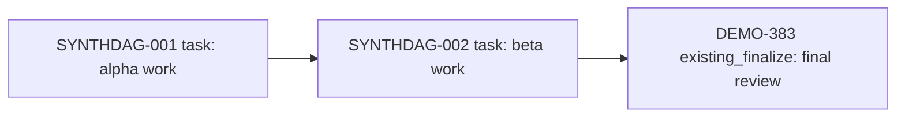

# Synthetic project fixture

All names, issue identifiers and UUIDs in this fixture are invented.

## DAG



## Manifest

```yaml
schema: symphony-dag-manifest/v1
project:
  code: sample-dag
  color: cyan
  base_branch: main
  human_lead: Test Lead
  human_lead_github: test-lead
  linear_issue_labels: [cyan]
  github_pr_labels: [cyan, symphony]
defaults:
  initial_state: Todo
  maturity_label: mature
  relation_type: blocks
nodes:
  - id: SYNTHDAG_001
    payload_key: SYNTHDAG-001
    title: Alpha work
    type: task
    difficulty: small
    labels: [cyan]
    branch:
      template: symphony/sample-dag/${issue}/alpha
      base: main
      birth: on_dispatch
    pr:
      create: on_branch_birth
      base: main
      draft: true
      labels: [cyan, symphony]
  - id: SYNTHDAG_002
    payload_key: SYNTHDAG-002
    title: Beta work
    type: task
    difficulty: small
    labels: [cyan]
    branch:
      template: symphony/sample-dag/${issue}/beta
      base: main
      birth: on_dispatch
    pr:
      create: on_branch_birth
      base: main
      draft: true
      labels: [cyan, symphony]
  - id: SYNTHDAG_003
    existing_issue: DEMO-383
    issue_id: 00000000-0000-4000-8000-000000000383
    title: Final review
    type: existing_finalize
    labels: [cyan]
    branch:
      template: symphony/sample-dag/${issue}/final
      base: main
      birth: on_dispatch
    pr:
      create: on_branch_birth
      base: main
      draft: true
      labels: [cyan, symphony]
edges:
  - from: SYNTHDAG_001
    to: SYNTHDAG_002
  - from: SYNTHDAG_002
    to: SYNTHDAG_003
```

## Decisions

| Decision | Reason |
| --- | --- |
| Use direct blocker relations | Each hard edge is explicit. |
| Keep task PRs based on main | Task branches use one selected base. |
